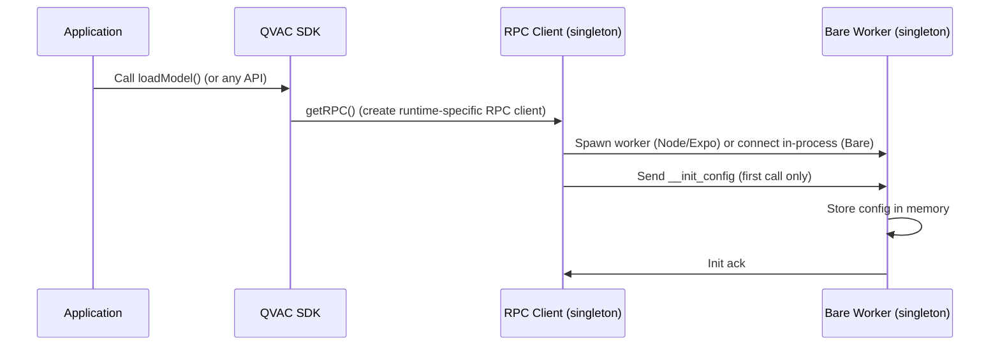
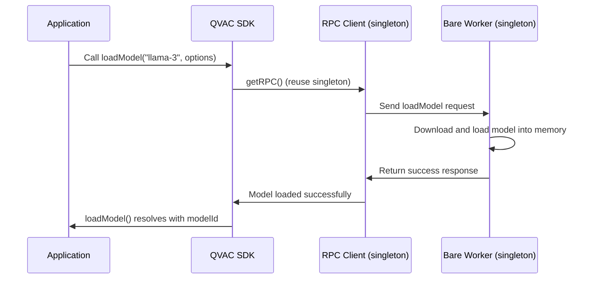
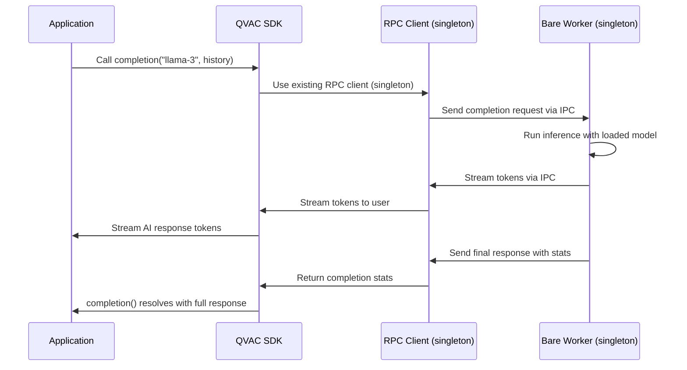
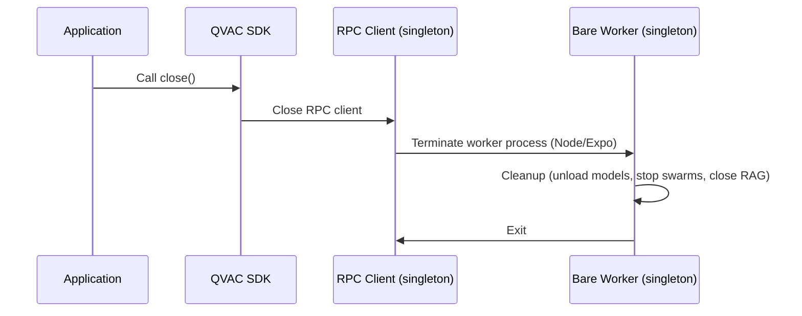

## Overview

The SDK supports multiple JS runtimes, but its [underlying components](/v0.7.0/addons) run only on [Bare](https://bare.pears.com). When the SDK runs in a runtime other than Bare, it spawns a Bare worker where all AI operations will take place. The worker is started lazily on the first RPC call and can be explicitly shut down with `close()`.

## Phase 1: initialization

The first time you call `loadModel()` (or any function other than `close()`), the SDK performs a complete initialization sequence. It initializes a runtime-specific RPC client and sends configuration to the worker via the internal `__init_config` message. The worker process is spawned once and reused for subsequent calls until you explicitly close it. In Bare runtime, no separate worker process is spawned; requests are handled in-process.

## Phase 2: model loading

There is only a single RPC client and Bare worker per application, not per model — i.e., singleton pattern. The model is downloaded and loaded into memory, and registered with a unique ID. From that point on, it will be available for AI inference until you unload it — call `unloadModel()` to free its memory.

## Phase 3: inference

You can call `loadModel()` multiple times to make multiple models ready for use simultaneously. Additionally, you can perform AI inference multiple times with all of them. When you no longer need a model, call `unloadModel()` to free up resources.

## Phase 4: shutdown

`close()` explicitly shuts down the worker and releases the RPC connection. In Node/Expo, this terminates the worker process; in Bare, the call is a no-op since there is no separate worker process. After `close()`, the next SDK call will reinitialize the RPC client and spawn a fresh worker.

<Callout title="Tip" type="success">
`unloadModel()` will automatically close the RPC connection when there are no active models or providers, but `close()` is the explicit way to shut down the SDK instance.
</Callout>

