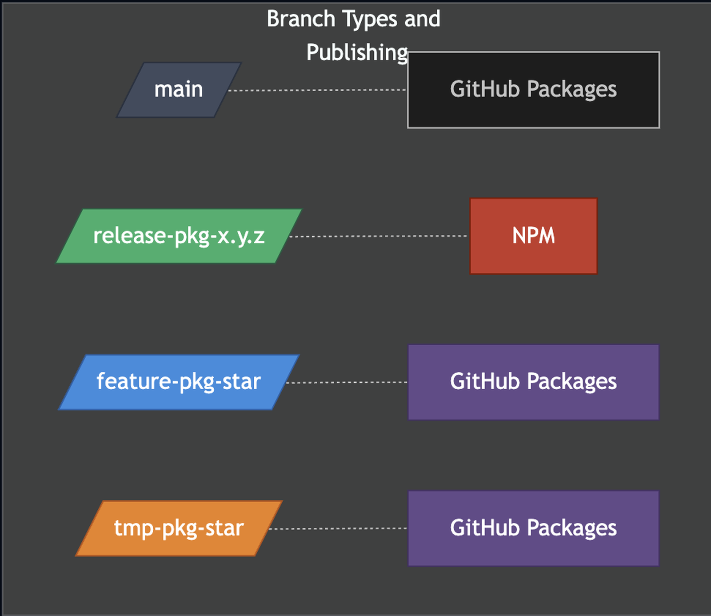

# GitFlow for QVAC Public SDKs & Model Packages

This repo uses a **main-first GitFlow** designed for public-facing SDK/model packages:

- **All development merges into `main`.**
- **Releases are cut from versioned `release-<package>-<x.y.z>` branches.**
- **Patches are cherry-picked from `main` into the appropriate release branch.**
- **`feature-*` and `tmp-*` branches are isolated from release (NPM) pipelines.**
- CI/CD uses **path-scoped triggers** so only the impacted package(s) build and publish.

> **Why this exists:** we want a predictable, repeatable release process across all packages, while keeping day-to-day development fast and centralized.

---

## Repo conventions

- Packages live under: `packages/<package>/`
- Each package owns its own:
  - `packages/<package>/package.json`
  - `packages/<package>/CHANGELOG.md` (or equivalent changelog file)
- CI workflows are:
  - **Scoped** by `paths: packages/<package>/**`
  - Supports a `workdir` input (or env var) that points to the package folder

---

## Branch types (naming, purpose, publishing)

| Branch type | Pattern | Purpose | Publishes to | Notes |
|---|---|---|---|---|
| Main | `main` | All active development | GitHub Packages (**dev**) | Default integration branch |
| Release | `release-<package>-<x.y.z>` | Versioned release line | **NPM** | Stable releases only |
| Feature | `feature-<package>-*` | Isolated work not meant to affect releases | GitHub Packages (**feature**) | Never publish to NPM |
| Temp | `tmp-<package>-*` | QA, preview, experiments | GitHub Packages (**temp**) | Never publish to NPM |

**Publishing semantics:**
- GitHub Packages dist-tags: `dev`, `feature`, `temp`
- NPM dist-tags: `latest` (or `next`/`beta` if explicitly needed)

---


## Release flow (new version x.y.z)

### 1) Cut a release branch from `main`

```bash
git checkout main
git pull
git checkout -b release-<package>-<x.y.z>
git push -u origin release-<package>-<x.y.z>
```

### 2) Open a “Release PR” into the release branch

The PR **must** include:
- **Version bump** in `packages/<package>/package.json` → `x.y.z`
- **Changelog update** in `packages/<package>/CHANGELOG.md`

PR naming suggestion:
- `release(<package>): v<x.y.z>`

### 3) Merge the Release PR

On merge, CI should:
- Build/package the artifact
- Create a git tag **and** GitHub release
- Publish **to NPM** for `release-*`

**Tag format (standard):**
- `<package>-v<x.y.z>`  
  Example: `qvac-sdk-v1.0.0`

### 4) Merge back into `main` (recommended)

This keeps `main` aligned with what was actually shipped (version + changelog).

```bash
git checkout main
git pull
git merge --no-ff origin/release-<package>-<x.y.z>
git push
```

---

## Patch flow (x.y.z → x.y.(z+1))

### 1) Implement the fix on `main`

- Do the work in `main` via the normal PR process.
- Merge into `main`.

### 2) Ensure you have the correct release base

If the release branch for the current version exists, use it. Otherwise, branch from the release base you intend to patch.

```bash
git checkout release-<package>-<x.y.z>
git pull
git checkout -b release-<package>-<x.y.(z+1)>
git push -u origin release-<package>-<x.y.(z+1)>
```

### 3) Cherry-pick the fix commit(s) from `main`

```bash
git checkout release-<package>-<x.y.(z+1)>
git cherry-pick <commit_sha_from_main>
git push
```

### 4) Open a PR into the patch release branch

The PR **must** include:
- Version bump to `x.y.(z+1)`
- Changelog entry describing the patch

### 5) Merge PR → CI publishes patch to NPM

CI should:
- Publish to NPM
- Tag + GitHub release using `<package>-v<x.y.(z+1)>`

### 6) Merge patch branch back into `main` (recommended)

This prevents repeated cherry-picks for the same patch metadata later.

---

## Feature & temp branches (non-release publishing)

### `feature-<package>-*`
Use for changes that must **not** enter the immediate release train.

CI behavior:
- Build on pushes/PRs
- Publish to GitHub Packages with dist-tag `feature`
- **Never publish to NPM**
- Does not create git tags or GitHub releases

### `tmp-<package>-*`
Use for QA, previews, and experiments.

CI behavior:
- Build on pushes/PRs
- Publish to GitHub Packages with dist-tag `temp`
- **Never publish to NPM**
- Does not create git tags or GitHub releases

---

## Release PR enforcement (CI policy)

For **all** `release-*` branches:

✅ Required in PR:
- `packages/<package>/package.json` version **must** increase vs base
- `packages/<package>/CHANGELOG.md` **must** be updated

❌ CI will fail if:
- Version is unchanged / not incremented
- Changelog is missing or unchanged

---

## CI/CD routing requirements (high level)

To reflect the branch intent correctly:

- **NPM publish jobs**
  - Trigger **only** on `release-*` branches (or tags created from them)
  - Must require version+changelog checks

- **GitHub Packages publish jobs**
  - Trigger on:
    - `main` → dist-tag `dev`
    - `feature-*` → dist-tag `feature`
    - `tmp-*` → dist-tag `temp`

- **Path scoping**
  - All package workflows must use:
    - `paths: packages/<package>/**`
  - Reusable workflows should accept a `workdir` input to point at the package directory.

---

## Quick reference (one-liners)

- Cut release branch:
  - `release-<package>-<x.y.z>` from `main`
- Patch:
  - Fix in `main` → cherry-pick to `release-<package>-<x.y.(z+1)>`
- Tag:
  - `<package>-v<x.y.z>` (example: `qvac-sdk-v1.0.0`)
- Publishing:
  - `main` → GitHub Packages `dev`
  - `release-*` → NPM
  - `feature-*` → GitHub Packages `feature`
  - `tmp-*` → GitHub Packages `temp`

---

## Diagrams


```md

```
