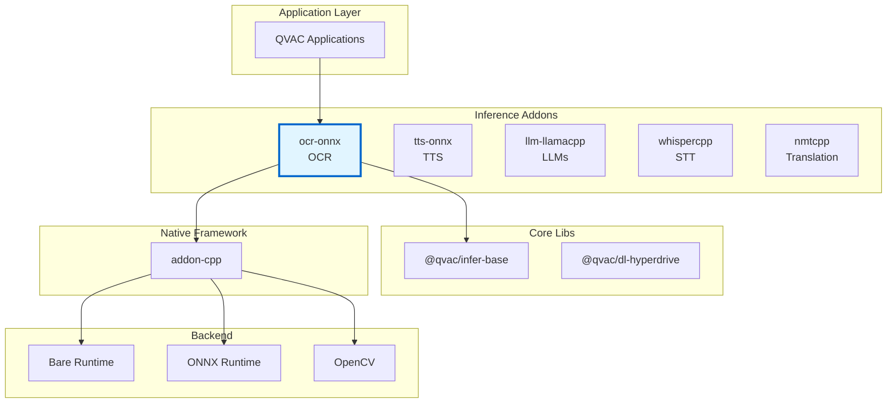
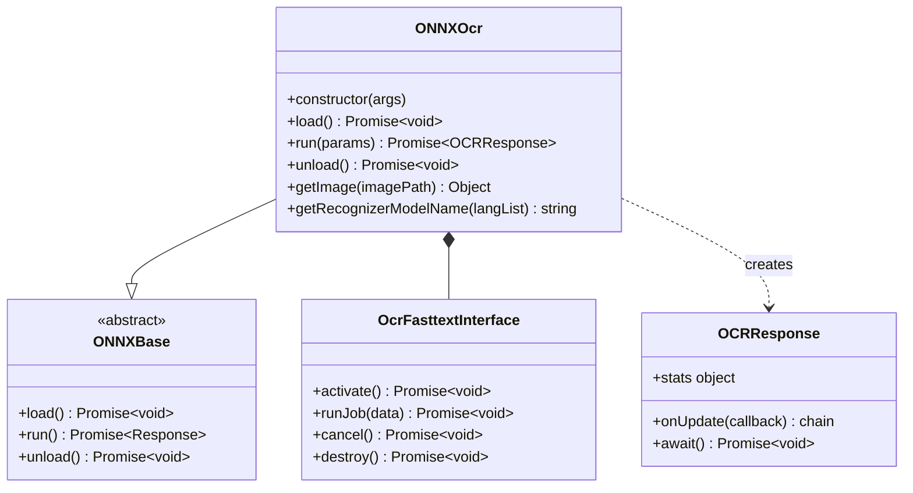
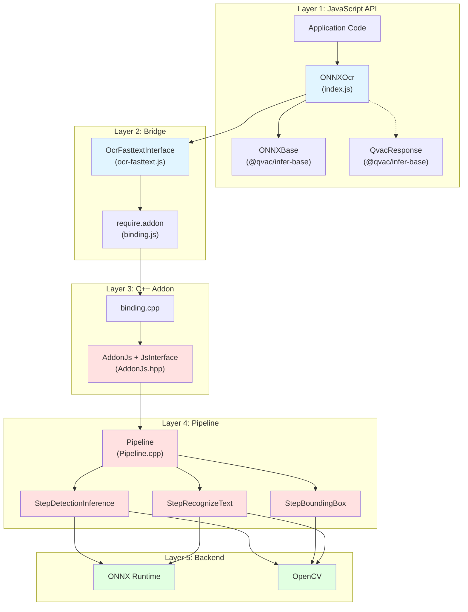
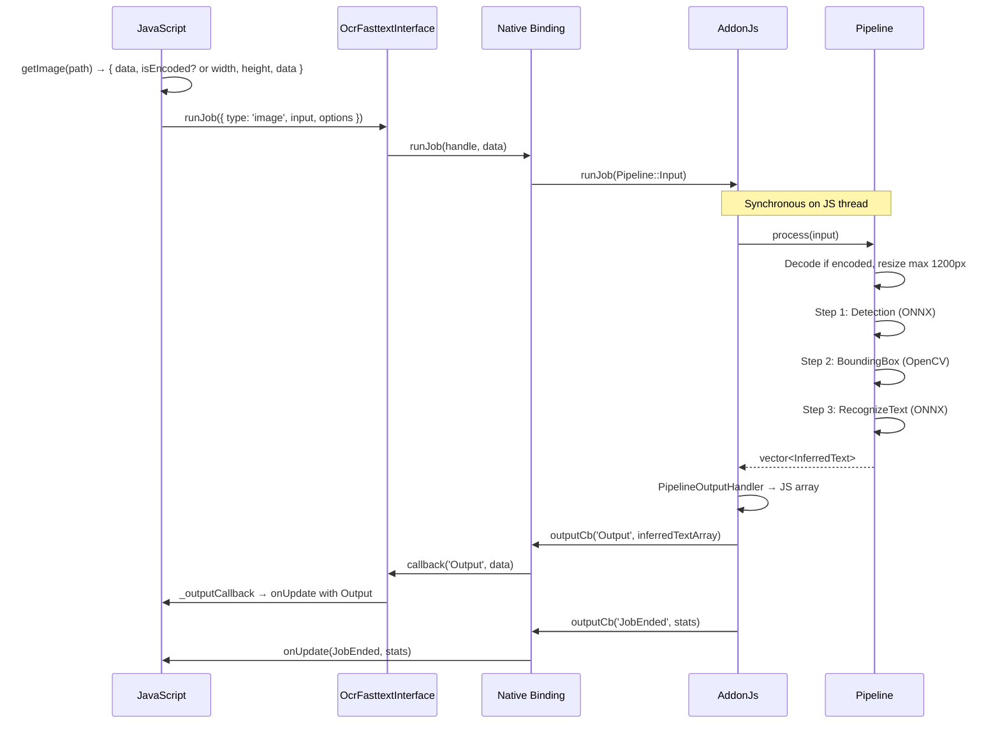

# Architecture Documentation

**Package:** `@qvac/ocr-onnx` v0.1.6  
**Stack:** JavaScript, C++20, ONNX Runtime, OpenCV, Bare Runtime, CMake, vcpkg  
**License:** Apache-2.0

---

## Table of Contents

### Overview
- [Purpose](#purpose)
- [Key Features](#key-features)
- [Target Platforms](#target-platforms)

### Core Architecture
- [Package Context](#package-context)
- [Public API](#public-api)
- [Internal Architecture](#internal-architecture)
- [Core Components](#core-components)
- [Bare Runtime Integration](#bare-runtime-integration)

### Architecture Decisions
- [Decision 1: ONNX Runtime as Inference Backend](#decision-1-onnx-runtime-as-inference-backend)
- [Decision 2: Bare Runtime over Node.js](#decision-2-bare-runtime-over-nodejs)
- [Decision 3: Sequential Pipeline (No Threading)](#decision-3-sequential-pipeline-no-threading)
- [Decision 4: Single-Job Design](#decision-4-single-job-design)
- [Decision 5: Flexible Image Input (BMP in JS, JPEG/PNG in C++)](#decision-5-flexible-image-input-bmp-in-js-jpegpng-in-c)
- [Decision 6: Model Paths Supplied by Application](#decision-6-model-paths-supplied-by-application)
- [Decision 7: TypeScript Definitions](#decision-7-typescript-definitions)

### Technical Debt
- [Limited Error Context](#1-limited-error-context)

---

# Overview

## Purpose

`@qvac/ocr-onnx` is a cross-platform npm package providing Optical Character Recognition (OCR) for Bare runtime applications. It runs a two-stage pipeline (text detection then text recognition) using **models exported from [EasyOCR](https://github.com/JaidedAI/EasyOCR) to ONNX format**. The pipeline (preprocessing, geometry, and tunable parameters such as `magRatio`) is aligned with EasyOCR’s design. The package runs these ONNX models via ONNX Runtime and OpenCV, with multi-language and multi-script support. Applications supply detector and recognizer model paths; the package handles image decoding, geometry, and inference orchestration.

**Core value:**
- High-level JavaScript API for OCR (load → run image path → receive text regions with bounding boxes)
- Multi-language support via script-family recognizer models (latin, arabic, bengali, cyrillic, devanagari, thai, CJK, etc.)
- Flexible image input: BMP decoded in JavaScript; JPEG and PNG passed encoded to C++ for OpenCV decoding
- Same addon-cpp patterns as other QVAC inference addons for consistency

## Key Features

- **Models exported from EasyOCR to ONNX**: Two-stage flow—detector (ONNX) locates text regions; OpenCV extracts bounding boxes; recognizer (ONNX) extracts text per region. The detector and recognizer are EasyOCR models exported to ONNX; preprocessing (e.g. dynamic-width recognizer, CRAFT-style detection) is aligned with EasyOCR.
- **Multi-script support**: Latin, Arabic, Bengali, Cyrillic, Devanagari, Thai, Chinese (sim/tra), Japanese, Korean, Tamil, Telugu, Kannada
- **Cross-platform**: macOS, Linux, Windows, iOS, Android with platform-specific ONNX execution providers (CoreML, NNAPI, DirectML)
- **Image formats**: BMP (decoded in JS), JPEG and PNG (decoded in C++ via OpenCV)
- **Tunable pipeline**: magRatio, defaultRotationAngles, contrastRetry, lowConfidenceThreshold, recognizerBatchSize
- **Single job at a time**: One image in flight per instance; simple lifecycle

## Target Platforms

| Platform | Architecture | Min Version | Status | GPU Support |
|----------|-------------|-------------|--------|-------------|
| macOS | arm64, x64 | 14.0+ | ✅ Tier 1 | CoreML |
| iOS | arm64 | 17.0+ | ✅ Tier 1 | CoreML |
| Linux | arm64, x64 | Ubuntu-22+ | ✅ Tier 1 | — |
| Android | arm64 | 12+ | ✅ Tier 1 | NNAPI |
| Windows | x64 | 10+ | ✅ Tier 1 | DirectML |

**Dependencies:**
- qvac-lib-inference-addon-cpp (≥1.0.0): C++ addon framework (JsInterface, AddonJs)
- ONNX Runtime: Inference engine (platform-specific EPs via vcpkg)
- OpenCV (opencv4, features: jpeg, png, quirc, tiff, webp): Image decode and geometry
- Bare Runtime (≥1.19.3): JavaScript runtime

---

# Core Architecture

## Package Context

### Ecosystem Position

📊 LLM-Friendly: Package Relationships

**Dependency Table:**

| Package | Type | Version | Purpose |
|---------|------|---------|---------|
| @qvac/infer-base | Framework | ^0.1.0 | Base class (ONNXBase), response handling |
| @qvac/error | Runtime | ^0.1.0 | Structured errors |
| qvac-lib-inference-addon-cpp | Native | ≥1.0.0 | JsInterface, AddonJs, output handlers |
| ONNX Runtime | Native | via vcpkg | Detector and recognizer inference |
| OpenCV | Native | via vcpkg | Image decode (JPEG/PNG), geometry, preprocessing |
| Bare Runtime | Runtime | ≥1.19.3 | JavaScript execution |

**Integration Points:**

| From | To | Mechanism | Data Format |
|------|-----|-----------|-------------|
| JavaScript | ONNXOcr | Constructor | args with params (pathDetector, pathRecognizer, langList, etc.) |
| ONNXOcr | ONNXBase | Inheritance | load / run / unload |
| ONNXOcr | OcrFasttextInterface | Composition | createInstance, runJob, activate |
| OcrFasttextInterface | C++ Addon | require.addon() | Native binding |
| run(input) | getImage(path) | JS | BMP raw pixels or JPEG/PNG buffer (isEncoded) |

---

## Public API

### Main Class: ONNXOcr

📊 LLM-Friendly: Class Responsibilities

**Component Roles:**

| Class | Responsibility | Lifecycle | Dependencies |
|-------|----------------|-----------|--------------|
| ONNXOcr | Orchestrate load/run/unload, validate params, resolve recognizer model name, decode BMP / pass JPEG-PNG | Created by user, persistent | OcrFasttextInterface, supportedLanguages |
| ONNXBase | Standard inference API (load/run/unload) | Abstract base class | None |
| OcrFasttextInterface | JS wrapper around native binding, error translation | Created by ONNXOcr in _load() | Native binding |
| OCRResponse | Deliver output and stats via onUpdate callback | Created per run(), short-lived | None |

**Key Relationships:**

| From | To | Type | Purpose |
|------|-----|------|---------|
| ONNXOcr | ONNXBase | Inheritance | Standard QVAC inference API |
| ONNXOcr | OcrFasttextInterface | Composition | Native addon lifecycle and runJob |
| ONNXOcr | OCRResponse | Creates | Per-run output (InferredText array, stats) |

---

## Internal Architecture

### Architectural Pattern

The package follows a **layered architecture** with clear separation of concerns:

📊 LLM-Friendly: Layer Responsibilities

**Layer Breakdown:**

| Layer | Components | Responsibility | Language | Why This Layer |
|-------|------------|----------------|----------|----------------|
| 1. JavaScript API | ONNXOcr, ONNXBase | High-level API, param validation, language filtering, image format dispatch | JS | Ergonomic API for npm consumers |
| 2. Bridge | OcrFasttextInterface, binding.js | JS↔C++ communication, error translation to QvacErrorAddonOcr | JS | Handle lifecycle, type conversion |
| 3. C++ Addon | AddonJs.hpp, binding.cpp | createInstance, runJob, config parsing, output handler (Pipeline::Output → JS array) | C++ | addon-cpp patterns, single-threaded execution |
| 4. Pipeline | Pipeline, StepDetectionInference, StepBoundingBox, StepRecognizeText | Sequential OCR: detect → boxes → recognize | C++ | Orchestration and ONNX/OpenCV usage |
| 5. Backend | ONNX Runtime, OpenCV | Tensor inference, image decode, resize, geometry | C++ | Optimized inference and image ops |

**Data Flow Through Layers:**

| Direction | Path | Data Format | Transform |
|-----------|------|-------------|-----------|
| Input → | JS run({ path }) | image path | getImage(path) → { data, width?, height?, isEncoded? } |
| Input → | Bridge → Addon | runJob({ type: 'image', input, options }) | Object with image buffer and options |
| Input → | Addon → Pipeline | Pipeline::Input | Validated; encoded decoded by OpenCV if isEncoded |
| Pipeline | Step 1 → Step 2 → Step 3 | cv::Mat, textMap/linkMap, boxes, InferredText[] | Detection → BoundingBox → Recognition |
| Output ← | Pipeline → Addon | std::vector&lt;InferredText&gt; | PipelineOutputHandler → JS array of [box, text, confidence] |
| Output ← | Addon → Bridge | outputCb('Output', data) then JobEnded with stats | Callback on same thread after process() returns |

---

## Core Components

### JavaScript Components

#### **ONNXOcr (index.js)**

**Responsibility:** Main API class; validates params (langList, pathDetector, pathRecognizer or pathRecognizerPrefix); filters unsupported languages; resolves recognizer model name from lang list; loads addon and activates; runs by reading image from path and calling runJob; maps addon output events to base-class callback (Output, JobEnded with stats).

**Why JavaScript:**
- High-level API and validation (required params, language support)
- Image format detection and BMP decoding (magic bytes, pixel extraction)
- JPEG/PNG passed through as encoded buffers for C++ to decode
- Recognizer model naming (latin, arabic, bengali, cyrillic, devanagari, other map) lives in JS with supportedLanguages

#### **OcrFasttextInterface (ocr-fasttext.js)**

**Responsibility:** Wrapper around native binding; translates native errors to QvacErrorAddonOcr (codes 9001–9016); exposes createInstance (via constructor), loadWeights, activate, runJob, cancel, destroy.

**Why JavaScript:**
- Clean API over raw C++ bindings
- Typed error codes for consumers
- Handle lifecycle (null check on destroy)

#### **addonLogging (addonLogging.js)**

**Responsibility:** Re-exports setLogger and releaseLogger from binding for C++ log routing.

**Why JavaScript:** Same pattern as other addons; allows app to plug in logger.

### C++ Components

#### **AddonJs + custom createInstance/runJob (addon/AddonJs.hpp)**

**Responsibility:** Parses configuration from JS (pathDetector, pathRecognizer, langList, useGPU, timeout, magRatio, defaultRotationAngles, contrastRetry, lowConfidenceThreshold, recognizerBatchSize); constructs Pipeline; registers PipelineOutputHandler to convert Pipeline::Output to JS array of [ [box], text, confidence ]; creates AddonJs (addon-cpp) with Pipeline as model; runJob parses image input (raw or encoded) and options (paragraph, boxMarginMultiplier, rotationAngles) and calls addon.runJob(std::any(Pipeline::Input)).

**Why C++:**
- addon-cpp JsInterface and AddonJs run on JS thread; no separate worker thread
- Pipeline runs synchronously inside runJob; output callback invoked after process() returns
- Path handling for ORTCHAR_T (char vs wchar_t on Windows)

#### **Pipeline (pipeline/Pipeline.cpp)**

**Responsibility:** Sequential three-step OCR using models exported from EasyOCR to ONNX: (1) validate input, decode image if encoded, resize to max 1200px on longest side, run StepDetectionInference (textMap, linkMap); (2) StepBoundingBox (aligned/unaligned boxes); (3) StepRecognizeText (InferredText per region). Tracks detectionTime, recognitionTime, totalTime, textRegionsCount for runtimeStats(); timeout applies to pipeline run.

**Why C++:**
- Single-threaded by design to avoid races and keep shared state simple
- OpenCV and ONNX calls in one place; each step depends on previous output

#### **StepDetectionInference (pipeline/StepDetectionInference.cpp)**

**Responsibility:** Loads detector ONNX model from path; preprocesses image (resize, normalize with mean/variance); runs ONNX inference; extracts textMap and linkMap from output tensor; caps target size at 2560px (MAX_IMAGE_SIZE).

**Why C++:** Direct ONNX and OpenCV usage; ratio and size constants match detector model expectations.

#### **StepBoundingBox (pipeline/StepBoundingBox.cpp)**

**Responsibility:** Converts textMap and linkMap to aligned and unaligned bounding boxes (OpenCV geometry, no ONNX).

**Why C++:** Pure OpenCV logic; shared PipelineContext and step I/O types.

#### **StepRecognizeText (pipeline/StepRecognizeText.cpp)**

**Responsibility:** Loads recognizer ONNX model from path; for each box (with optional rotation and contrast retry), crops and preprocesses sub-images (e.g. height 64, width 512); runs recognizer inference; decodes to text and confidence; merges boxes when paragraph mode; returns std::vector&lt;InferredText&gt;.

**Why C++:** Batched recognizer inference, language-specific model, OpenCV for crop/warp.

---

## Bare Runtime Integration

### Communication Pattern

📊 LLM-Friendly: Thread Communication

**Thread Model:**

| Thread | Runs | Blocking |
|--------|------|----------|
| JavaScript | App code, addon createInstance/runJob, callbacks | runJob blocks until Pipeline::process() completes |

**No separate processing thread:** Addon uses addon-cpp AddonJs; the pipeline runs on the same thread that calls runJob. Output and JobEnded callbacks are invoked from that thread after process() returns.

**Synchronization:** Pipeline uses a mutex only for recording runtime stats (processingTime_, detectionTime_, recognitionTime_, textRegionsCount_) for runtimeStats().

---

# Architecture Decisions

## Decision 1: ONNX Runtime as Inference Backend

⚡ TL;DR

**Chose:** ONNX Runtime for both detector and recognizer models  
**Why:** Broad platform support, single model format, same choice as other QVAC ONNX addons  
**Cost:** Binary size, per-platform vcpkg and EP configuration

### Context

OCR requires two models: a detector (text region localization) and a recognizer (text string per region). This package uses **models exported from [EasyOCR](https://github.com/JaidedAI/EasyOCR) to ONNX format**; pipeline hyperparameters (e.g. magRatio, recognizer height/batch behavior) are aligned with EasyOCR. A runtime is needed that runs these ONNX models across all target platforms with optional GPU acceleration.

### Decision

Use ONNX Runtime for detector and recognizer inference, with platform-specific execution providers (CoreML, NNAPI, DirectML) via vcpkg feature selection.

### Rationale

**Consistency:** Aligns with other QVAC ONNX-based addons (e.g. TTS, OCR-fasttext); same build and distribution story.

**Platform coverage:** One format (ONNX), one API; EPs provide GPU where available without changing application code.

**Model ecosystem:** Detector and recognizer models are available in ONNX form; no custom runtime needed.

### Trade-offs
- ✅ Single model format and API across platforms
- ✅ GPU acceleration where supported
- ❌ Large static binary; Android strip steps for size
- ❌ Symbol hiding (version script / exported_symbols_list) needed when multiple ONNX addons load in same process

---

## Decision 2: Bare Runtime over Node.js

See [qvac-lib-inference-addon-cpp: Why Bare Runtime](https://github.com/tetherto/qvac-lib-inference-addon-cpp/blob/main/docs/architecture.md) for rationale.

**Summary:** Mobile support (iOS/Android), lightweight runtime, modern addon API. This package uses the same addon-cpp patterns (JsInterface, AddonJs) as other inference addons.

---

## Decision 3: Sequential Pipeline (No Threading)

⚡ TL;DR

**Chose:** Run detection → bounding box → recognition sequentially on the same thread  
**Why:** Simplicity and correctness; each step depends on the previous; avoids races and shared-state bugs  
**Cost:** No overlap of detection and recognition; one image at a time

### Context

The OCR pipeline has three stages: detection (ONNX), bounding box extraction (OpenCV), and recognition (ONNX). Each stage consumes the output of the previous one. A multi-threaded design would require careful synchronization and no clear latency win for a single image.

### Decision

Execute the pipeline sequentially in a single thread. No job queue or worker thread; runJob calls Pipeline::process() on the calling (JS) thread and returns after completion.

### Rationale

**Correctness:** No shared mutable state between steps; no risk of races or partial results.

**Simplicity:** Easier to reason about, debug, and tune (timeouts, batch sizes).

**Fit for single-job design:** With one image in flight, overlapping stages would add complexity without clear benefit.

### Trade-offs
- ✅ Simple control flow and error handling
- ✅ No threading bugs or priority inversion
- ❌ No pipelining of multiple images
- ❌ runJob blocks until the full pipeline finishes

---

## Decision 4: Single-Job Design

⚡ TL;DR

**Chose:** One job per instance; single fixed job ID (`'job'`)  
**Why:** Keeps API and lifecycle simple; one image in flight is sufficient for many use cases  
**Cost:** No built-in queue; apps that need concurrency use multiple instances

### Context

Applications may send one image at a time (e.g. document scan) or want to queue many images. Supporting a queue would require a worker thread, job IDs, and cancellation semantics.

### Decision

Support exactly one logical job per ONNXOcr instance. The public API uses a fixed job ID (ONNXOcr.JOB_ID = 'job'). Only one run() is in flight at a time; the next run() waits for the previous response to complete (via the base-class response flow).

### Rationale

**API simplicity:** No job IDs to track; one response per run().

**Lifecycle clarity:** Load once, run many times sequentially, unload when done. Aligns with sequential pipeline and single-threaded execution.

**Enough for most consumers:** Document scanning and form processing often process one image at a time; high-throughput batch can create multiple instances.

### Trade-offs
- ✅ Simple mental model and code
- ✅ No queue management or cancellation complexity in addon
- ❌ No built-in queue; concurrency requires multiple instances

---

## Decision 5: Flexible Image Input (BMP in JS, JPEG/PNG in C++)

⚡ TL;DR

**Chose:** Decode BMP in JavaScript; pass JPEG and PNG as raw bytes to C++ for OpenCV decoding  
**Why:** BMP is simple to parse in JS (no native dep); JPEG/PNG benefit from OpenCV’s optimized decode and consistent behavior  
**Cost:** Two code paths; BMP size limits and format quirks in JS

### Context

Images can be BMP, JPEG, or PNG. Decoding can happen in JavaScript (using only Buffer) or in C++ (OpenCV). Sending large decoded buffers across the boundary is expensive; sending encoded bytes and decoding once in C++ is often better.

### Decision

- **BMP:** Detect by magic bytes (0x42 0x4D); parse header and pixel data in JavaScript; send decoded { width, height, data } (no isEncoded).
- **JPEG / PNG:** Detect by magic bytes; read file contents and send { data: buffer, isEncoded: true }; C++ decodes with OpenCV (cv::imdecode) and converts BGR→RGB.

### Rationale

**BMP:** Simple format; no extra native dependency in JS; parsing is small and self-contained.

**JPEG/PNG:** OpenCV already in the stack for geometry; single decode path; avoids duplicating decoders or pushing large decoded buffers from JS.

### Trade-offs
- ✅ JPEG/PNG decoded once in C++ with a well-tested library
- ✅ BMP supported without adding a JS image library
- ❌ Two paths to maintain; BMP parsing in JS must handle variants (header sizes, padding)

---

## Decision 6: Model Paths Supplied by Application

⚡ TL;DR

**Chose:** Applications provide pathDetector and pathRecognizer (or pathRecognizerPrefix + model name); no built-in distribution  
**Why:** Keeps package size down and model evolution in app control  
**Cost:** Apps must obtain and version models themselves; Hyperdrive or other distribution may be added later

### Context

Detector and recognizer models are large and vary by language/script. Shipping them inside the package would bloat it and tie model updates to package releases. Alternative: apps supply paths (local or from a loader).

### Decision

Require the application to supply pathDetector and either pathRecognizer or (pathRecognizerPrefix + recognizer model name derived from langList). No built-in download or Hyperdrive integration in the current package. If future constraints (package size, model evolution) demand it, Hyperdrive-based distribution could be added.

### Rationale

**Package size:** No model bytes in the npm package.

**Flexibility:** Apps can use local files, their own CDN, or future P2P (e.g. Hyperdrive) without the addon dictating it.

**Versioning:** App controls which detector/recognizer versions to use.

### Trade-offs
- ✅ Small package; clear ownership of model acquisition
- ✅ Future option to add Hyperdrive or other distribution
- ❌ No out-of-the-box model distribution today

---

## Decision 7: TypeScript Definitions

⚡ TL;DR

**Chose:** Hand-written TypeScript definitions (index.d.ts)  
**Why:** Type safety, IDE support, API documentation  
**Cost:** Manual maintenance, must stay in sync with implementation

### Context

TypeScript users need types for the OCR API (params, run options, response, stats).

### Decision

Ship hand-written index.d.ts with ONNXOcr, ONNXOcrParams, OCRArgs, OCRRunParams, OCRStats, OCRResponse, and exports.

### Rationale

**Developer experience:** Autocomplete and compile-time checks for params and response shape.

**Documentation:** Types document required and optional fields (pathDetector, pathRecognizer, langList, useGPU, timeout, etc.).

### Trade-offs
- ✅ Better DX and refactor safety
- ❌ Must keep .d.ts in sync with index.js

---

# Technical Debt

### 1. Limited Error Context
**Status:** C++ exceptions lose stack and rich context when crossing the JS boundary  
**Issue:** Generic or minimal messages make debugging harder for consumers  
**Root Cause:** Bare’s JS/C++ boundary does not propagate structured error stacks  
**Plan:** Use structured error objects with codes and context, consistent with other addons (e.g. QvacErrorAddonOcr codes 9001–9016); document known failure modes in docs

---

**Related Document:**
- [data-flows-detailed.md](data-flows-detailed.md) - Detailed data flow diagrams and sequences

**Last Updated:** 2026-02-18
