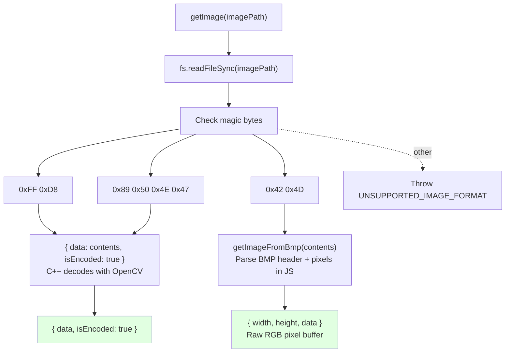
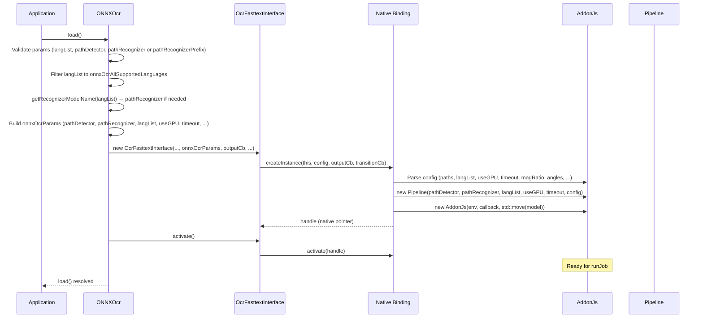

# Data Flows: @qvac/ocr-onnx

> **⚠️ Warning:** These diagrams reflect the data flows as of the last documentation update. The code may have changed since then. For debugging, regenerate or validate against the current source.

---

## Table of Contents

- [OCR Run Flow (Primary)](#ocr-run-flow-primary)
- [Pipeline Steps (Detection → Bounding Box → Recognition)](#pipeline-steps-detection--bounding-box--recognition)
- [Image Input Dispatch (BMP vs JPEG/PNG)](#image-input-dispatch-bmp-vs-jpegpng)
- [Recognizer Model Name Resolution](#recognizer-model-name-resolution)
- [Load and Activation Flow](#load-and-activation-flow)

---

## OCR Run Flow (Primary)

End-to-end flow from `run({ path, options })` to output and JobEnded.

```mermaid
sequenceDiagram
    participant App as Application
    participant OCR as ONNXOcr
    participant IF as OcrFasttextInterface
    participant Bind as Native Binding
    participant Addon as AddonJs
    participant Pipeline as Pipeline

    App->>OCR: run({ path: 'doc.png', options: { paragraph: true } })
    OCR->>OCR: getImage(path)
    Note over OCR: Read file, detect format (BMP/JPEG/PNG)
    alt BMP
        OCR->>OCR: getImageFromBmp(contents) → { width, height, data }
    else JPEG or PNG
        OCR->>OCR: { data: contents, isEncoded: true }
    end
    OCR->>IF: runJob({ type: 'image', input, options })
    IF->>Bind: runJob(handle, data)
    Bind->>Addon: runJob(Pipeline::Input)

    rect rgb(240, 248, 255)
        Note over Addon,Pipeline: Synchronous Pipeline::process()
        Addon->>Pipeline: process(input)
        Pipeline->>Pipeline: Validate; decode if isEncoded; resize max 1200px
        Pipeline->>Pipeline: Step 1: Detection → textMap, linkMap
        Pipeline->>Pipeline: Step 2: BoundingBox → aligned/unaligned boxes
        Pipeline->>Pipeline: Step 3: RecognizeText → InferredText[]
        Pipeline-->>Addon: Output (vector<InferredText>)
    end

    Addon->>Addon: PipelineOutputHandler → JS array [ [box], text, confidence ]...
    Addon->>Bind: outputCb('Output', inferredTextArray)
    Bind->>IF: callback('Output', data)
    IF->>OCR: _outputCallback → _addonOutputCallback
    OCR->>App: onUpdate('Output', data)

    Addon->>Bind: outputCb('JobEnded', stats)
    Bind->>App: onUpdate('JobEnded', { totalTime, detectionTime, recognitionTime, ... })
```

<details>
<summary>📊 LLM-Friendly: Run Data Transformations</summary>

**Data at Each Stage:**

| Stage | Input | Output | Notes |
|-------|-------|--------|-------|
| run(params) | { path, options? } | — | path required |
| getImage(path) | file path | { data, isEncoded? } or { width, height, data } | BMP: decoded in JS; JPEG/PNG: raw buffer + isEncoded |
| runJob | { type: 'image', input, options } | — | input = getImage result; options = paragraph, etc. |
| Pipeline::process | Pipeline::Input | vector&lt;InferredText&gt; | Single synchronous call |
| Output handler | InferredText[] | JS array of [ [[x,y]*4], text, confidence ] | One element per detected text region |
| JobEnded | — | { totalTime, detectionTime, recognitionTime, textRegionsCount } | From Pipeline::runtimeStats() |

</details>

---

## Pipeline Steps (Detection → Bounding Box → Recognition)

Internal C++ pipeline data flow.

```mermaid
flowchart LR
    subgraph Input
        IMG["Pipeline::Input<br/>image data (raw or encoded)"]
    end

    subgraph "Preprocess"
        DECODE["Decode if isEncoded<br/>(OpenCV imdecode)"]
        RESIZE["Resize longest side<br/>max 1200px"]
    end

    subgraph "Step 1: Detection"
        DET_IN["cv::Mat RGB"]
        DET_ONNX["Detector ONNX"]
        DET_OUT["textMap, linkMap<br/>+ PipelineContext"]
    end

    subgraph "Step 2: Bounding Box"
        BOX_IN["StepDetectionInference::Output"]
        BOX_CV["OpenCV geometry"]
        BOX_OUT["alignedBoxes<br/>unalignedBoxes"]
    end

    subgraph "Step 3: Recognition"
        REC_IN["StepBoundingBoxesOutput"]
        REC_ONNX["Recognizer ONNX<br/>(per region, batch)"]
        REC_OUT["vector<InferredText>"]
    end

    IMG --> DECODE
    DECODE --> RESIZE
    RESIZE --> DET_IN
    DET_IN --> DET_ONNX
    DET_ONNX --> DET_OUT
    DET_OUT --> BOX_IN
    BOX_IN --> BOX_CV
    BOX_CV --> BOX_OUT
    BOX_OUT --> REC_IN
    REC_IN --> REC_ONNX
    REC_ONNX --> REC_OUT

    style IMG fill:#e1f5ff
    style REC_OUT fill:#e1ffe1
```



<details>
<summary>📊 LLM-Friendly: Pipeline Step Summary</summary>

**Step Summary:**

| Step | Component | Input | Output | Backend |
|------|-----------|-------|--------|---------|
| Preprocess | Pipeline | Raw or encoded image | cv::Mat RGB, max 1200px | OpenCV |
| 1. Detection | StepDetectionInference | cv::Mat, paragraph, rotationAngles, boxMarginMultiplier | textMap, linkMap, context, imgResizeRatio | ONNX + OpenCV |
| 2. Bounding Box | StepBoundingBox | textMap, linkMap, context | alignedBoxes, unalignedBoxes | OpenCV |
| 3. Recognition | StepRecognizeText | boxes, context | std::vector&lt;InferredText&gt; | ONNX + OpenCV |

**Constants (from source):**

| Constant | Value | Location |
|----------|--------|----------|
| Max input size (resize) | 1200 px (longest side) | Pipeline.cpp |
| Max image size (detector) | 2560 px | StepDetectionInference.cpp |
| Default pipeline timeout | 120 s | Pipeline.hpp |
| Default magRatio | 1.5 | Pipeline.hpp |
| Default recognizer batch size | 32 | Pipeline.hpp |

</details>

---

## Image Input Dispatch (BMP vs JPEG/PNG)

How getImage() chooses decode path.



<details>
<summary>📊 LLM-Friendly: Image Format Handling</summary>

**Format Handling:**

| Format | Detection | Decode Location | Sent to C++ |
|--------|-----------|------------------|-------------|
| JPEG | 0xFF 0xD8 | C++ (OpenCV imdecode) | { data: Buffer, isEncoded: true } |
| PNG | 0x89 0x50 0x4E 0x47 | C++ (OpenCV imdecode) | { data: Buffer, isEncoded: true } |
| BMP | 0x42 0x4D | JS (getImageFromBmp) | { width, height, data } (raw RGB) |

</details>

---

## Recognizer Model Name Resolution

How the recognizer ONNX path is chosen from langList.

```mermaid
flowchart TB
    START["getRecognizerModelName(langList)"]
    LANG["For each lang in langList"]

    LATIN["latinLangList includes lang?"]
    ARABIC["arabicLangList?"]
    BENGALI["bengaliLangList?"]
    CYRILLIC["cyrillicLangList?"]
    DEVANAGARI["devanagariLangList?"]
    OTHER["otherLangStringMap[lang]?"]

    R["Return model name"]
    LATIN -->|yes| R
    ARABIC -->|yes| R
    BENGALI -->|yes| R
    CYRILLIC -->|yes| R
    DEVANAGARI -->|yes| R
    OTHER -->|yes| R

    LANG --> LATIN
    LATIN -->|no| ARABIC
    ARABIC -->|no| BENGALI
    BENGALI -->|no| CYRILLIC
    CYRILLIC -->|no| DEVANAGARI
    DEVANAGARI -->|no| OTHER
    OTHER -->|no| next lang or throw UNSUPPORTED_LANGUAGE

    R --> PATH["pathRecognizer = pathRecognizerPrefix + name + '.onnx'<br/>e.g. 'latin', 'arabic', 'thai', 'zh_sim'"]
```

<details>
<summary>📊 LLM-Friendly: Recognizer Model Names</summary>

**Script → recognizer model name:**

| Model name | Languages (examples) |
|------------|----------------------|
| latin | en, es, fr, de, it, pt, ... |
| arabic | ar, fa, ug, ur |
| bengali | bn, as, mni |
| cyrillic | ru, be, bg, uk, mn, ... |
| devanagari | hi, mr, ne, ... |
| thai | th |
| zh_sim | ch_sim |
| zh_tra | ch_tra |
| japanese | ja |
| korean | ko |
| tamil | ta |
| telugu | te |
| kannada | kn |

**Path:** If pathRecognizer is not provided, pathRecognizer = pathRecognizerPrefix + getRecognizerModelName(langList) + '.onnx'.

</details>

---

## Load and Activation Flow

Flow from `load()` to ready-for-run state.



<details>
<summary>📊 LLM-Friendly: Load Sequence</summary>

**Required params:** pathDetector, langList; pathRecognizer or pathRecognizerPrefix (and then pathRecognizer is derived from getRecognizerModelName(langList)).

**Optional params:** useGPU (default true), timeout (default 120), magRatio, defaultRotationAngles, contrastRetry, lowConfidenceThreshold, recognizerBatchSize.

**State:** After load() and activate(), the addon is ready; runJob() can be called with image input.

</details>

---

**Last Updated:** 2026-02-18
