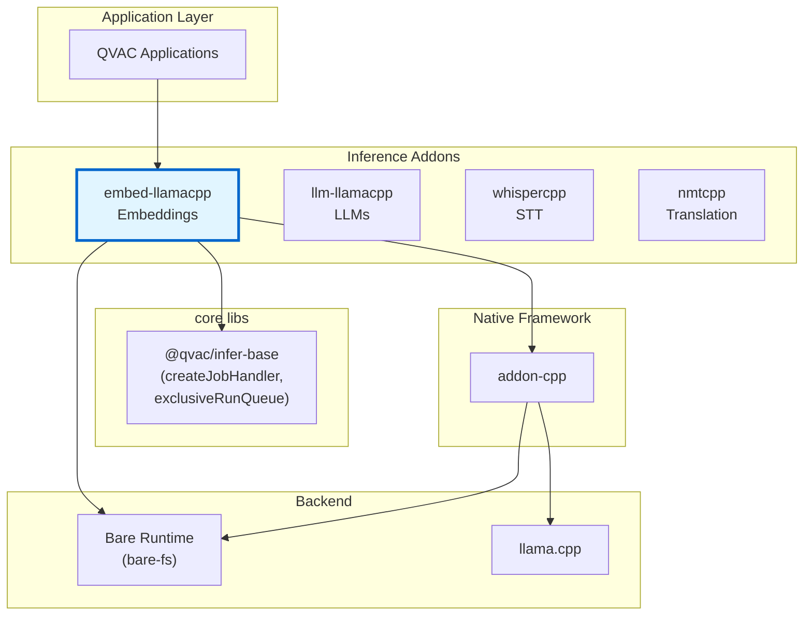
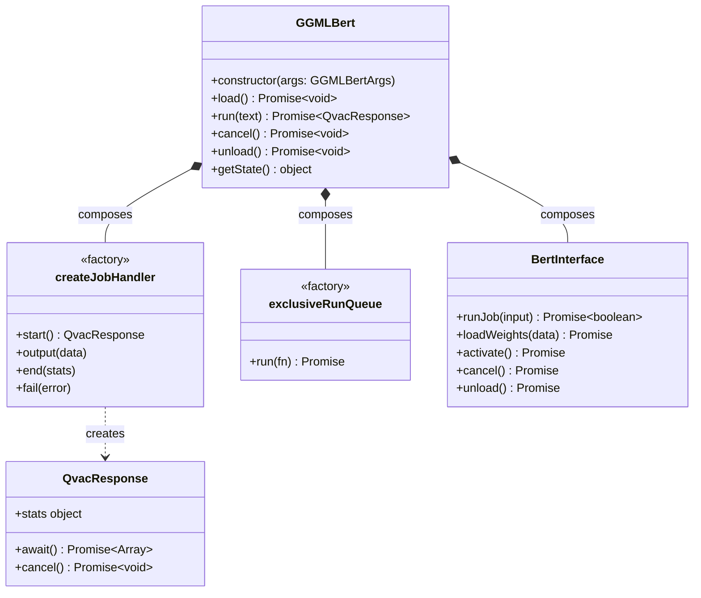
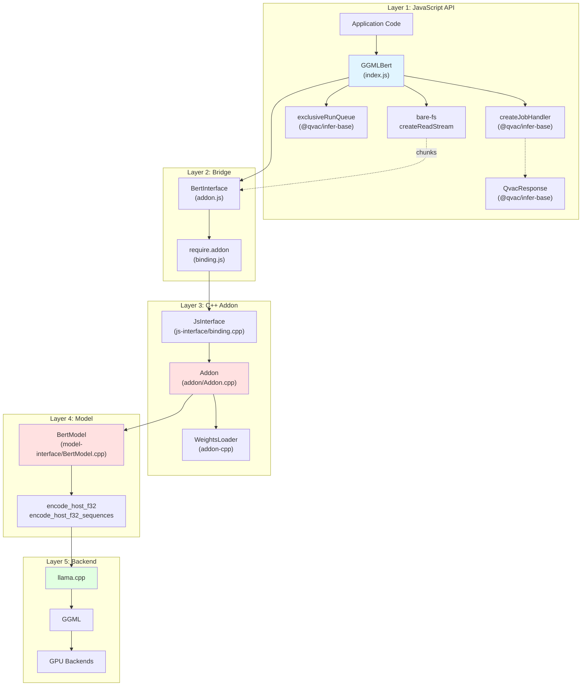
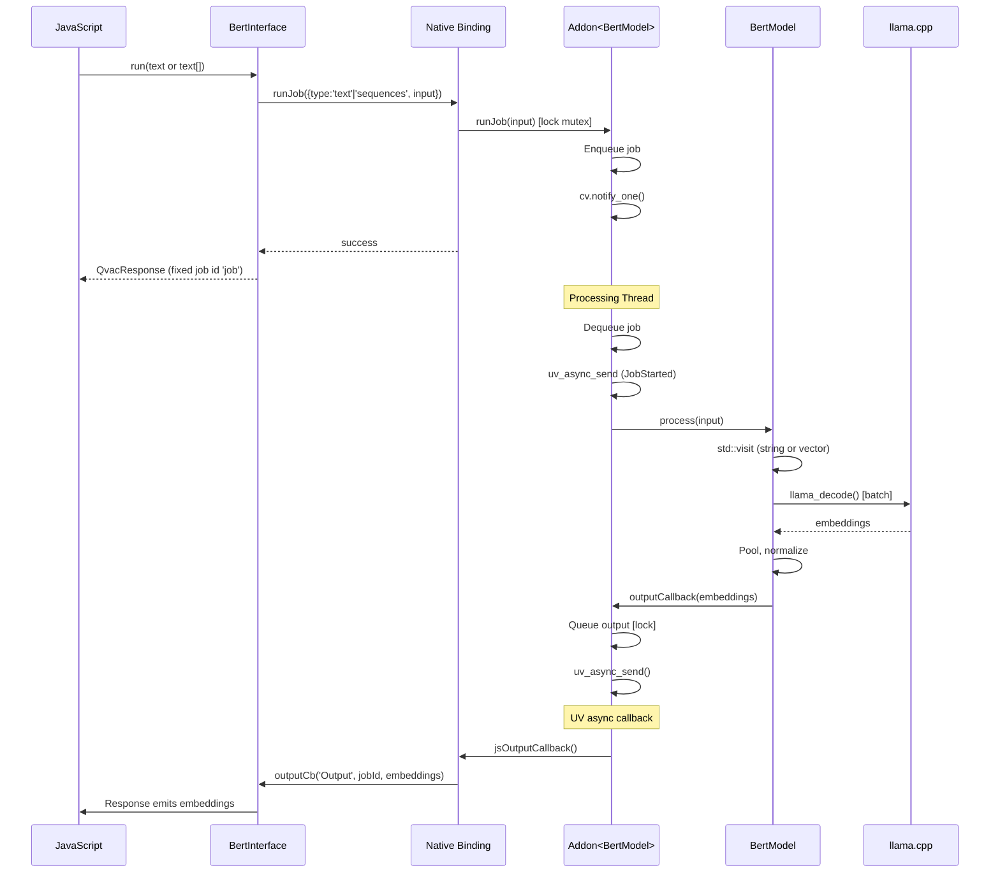

# Architecture Documentation

**Package:** `@qvac/embed-llamacpp` v0.14.0  
**Stack:** JavaScript, C++20, llama.cpp, Bare Runtime, CMake, vcpkg  
**License:** Apache-2.0  
**Addon-cpp:** ≥1.1.2 (single job per run, `runJob(input)`, `cancel()` waits until job stopped, no transition callback)

---

## Table of Contents

### Overview
- [Purpose](#purpose)
- [Key Features](#key-features)
- [Target Platforms](#target-platforms)

### Core Architecture
- [Package Context](#package-context)
- [Public API](#public-api)
- [Internal Architecture](#internal-architecture)
- [Core Components](#core-components)
- [Bare Runtime Integration](#bare-runtime-integration)

### Architecture Decisions
- [Decision 1: llama.cpp as Inference Backend](#decision-1-llamacpp-as-inference-backend)
- [Decision 2: Bare Runtime over Node.js](#decision-2-bare-runtime-over-nodejs)
- [Decision 3: Caller-Provided File Paths](#decision-3-caller-provided-file-paths)
- [Decision 4: Incremental Buffer-Based Weight Loading](#decision-4-incremental-buffer-based-weight-loading)
- [Decision 5: Batch Processing as Primary Use Case](#decision-5-batch-processing-as-primary-use-case)
- [Decision 6: Exclusive Run Queue](#decision-6-exclusive-run-queue)
- [Decision 7: TypeScript Definitions](#decision-7-typescript-definitions)

### Technical Debt
- [Limited Error Context](#1-limited-error-context)

---

# Overview

## Purpose

`@qvac/embed-llamacpp` is a cross-platform npm package providing text embedding generation for Bare runtime applications. It wraps llama.cpp in a JavaScript-friendly API, enabling local embedding model execution on desktop and mobile with CPU/GPU acceleration.

**Core value:**
- High-level JavaScript API for embedding generation
- Direct file streaming from disk via `bare-fs` (no download/loader layer)
- Batch processing for high-throughput use cases
- Vector embeddings for semantic search and similarity

## Key Features

- **Cross-platform**: macOS, Linux, Windows, iOS, Android
- **Caller-supplied paths**: Application passes absolute file paths; addon streams them from disk
- **Batch processing**: Process multiple texts in a single forward pass
- **GPU acceleration**: Metal, Vulkan, OpenCL
- **Quantized models**: GGUF format (Q2-Q8, 1-bit variants)
- **Sharded loading**: Caller passes every shard + `.tensors.txt` companion; addon streams them in order
- **Encoder-only models**: Optimized for embedding generation

## Target Platforms

| Platform | Architecture | Min Version | Status | GPU Support |
|----------|-------------|-------------|--------|-------------|
| macOS | arm64, x64 | 14.0+ | ✅ Tier 1 | Metal |
| iOS | arm64 | 17.0+ | ✅ Tier 1 | Metal |
| Linux | arm64, x64 | Ubuntu-22+ | ✅ Tier 1 | Vulkan |
| Android | arm64 | 12+ | ✅ Tier 1 | Vulkan, OpenCL (Adreno 700+) |
| Windows | x64 | 10+ | ✅ Tier 1 | Vulkan |

Tier 1: Platform targets for which prebuilds are provided as defined by the .github/workflows/prebuilds-qvac-lib-infer-llamacpp-embed.yml workflow. Compilation and test failures for these targets will cause workflow runs to go red.

**Dependencies:**
- qvac-lib-inference-addon-cpp (≥1.1.2): C++ addon framework
- @qvac/infer-base: Provides `createJobHandler` and `exclusiveRunQueue` helpers (composition, no base class)
- qvac-fabric-llm.cpp (≥7248.2.3): Inference engine
- Bare Runtime (≥1.24.0): JavaScript runtime (provides `bare-fs` for direct file streaming)

---

# Core Architecture

## Package Context

### Ecosystem Position



<details>
<summary>📊 LLM-Friendly: Package Relationships</summary>

**Dependency Table:**

| Package | Type | Version | Purpose |
|---------|------|---------|---------|
| @qvac/infer-base | Framework | ^0.4.0 | `createJobHandler`, `exclusiveRunQueue`, `QvacResponse` helpers (composition, no base class) |
| qvac-lib-inference-addon-cpp | Native | ≥1.1.2 | C++ addon framework |
| llama.cpp | Native | ≥7248.2.1 | Inference engine |
| Bare Runtime | Runtime | ≥1.24.0 | JavaScript execution, `bare-fs`, `bare-path` |

**Integration Points:**

| From | To | Mechanism | Data Format |
|------|-----|-----------|-------------|
| JavaScript | GGMLBert | Constructor | `{ files, config, logger, opts }` (single object) |
| GGMLBert | createJobHandler / exclusiveRunQueue | Composition | Function calls |
| GGMLBert | BertInterface | Composition | Method calls |
| GGMLBert | bare-fs | `fs.createReadStream(path)` | Raw chunks per shard |
| BertInterface | C++ Addon | require.addon() | Native binding |

</details>

---

## Public API

### Main Class: GGMLBert

`GGMLBert` is a standalone class (no base class). It composes helpers from `@qvac/infer-base` and talks to the native addon via `BertInterface`. The caller passes all file paths explicitly; there is no downloader, loader, or weights provider.



<details>
<summary>📊 LLM-Friendly: Class Responsibilities</summary>

**Component Roles:**

| Class / Helper | Responsibility | Lifecycle | Dependencies |
|----------------|----------------|-----------|--------------|
| GGMLBert | Standalone class. Orchestrate model lifecycle, stream files from disk, dispatch inference | Created by user, persistent | `createJobHandler`, `exclusiveRunQueue`, `BertInterface`, `bare-fs` |
| createJobHandler | Factory producing a job handler with `start/output/end/fail` semantics; returns a `QvacResponse` | Created once per GGMLBert | None |
| exclusiveRunQueue | Factory producing a promise queue that serialises `load()` / `run()` / `unload()` calls | Created once per GGMLBert | None |
| QvacResponse | Return embedding results and expose `await()`/`cancel()`/`stats` | Created per `run()` call, short-lived | None |
| BertInterface | JS wrapper around the native addon (`require.addon`) | Created in `_load()`, lives for model lifetime | Native addon |

**Key Relationships:**

| From | To | Type | Purpose |
|------|-----|------|---------|
| GGMLBert | createJobHandler | Composition | Job state machine + response emission |
| GGMLBert | exclusiveRunQueue | Composition | Serialise concurrent callers |
| GGMLBert | BertInterface | Composition | Native addon calls |
| GGMLBert | bare-fs | Direct use | Stream each caller-supplied path into the addon |

</details>

---

## Internal Architecture

### Architectural Pattern

The package follows a **layered architecture** with clear separation of concerns:



<details>
<summary>📊 LLM-Friendly: Layer Responsibilities</summary>

**Layer Breakdown:**

| Layer | Components | Responsibility | Language | Why This Layer |
|-------|------------|----------------|----------|----------------|
| 1. JavaScript API | GGMLBert (standalone class), `createJobHandler`, `exclusiveRunQueue`, `bare-fs` | High-level API, file streaming, job/queue composition | JS | Ergonomic API for npm consumers |
| 2. Bridge | BertInterface, binding.js | JS↔C++ communication | JS wrapper | Lifecycle management, handle safety |
| 3. C++ Addon | JsInterface, Addon<T> | Job queue, threading, callbacks | C++ | Performance, native integration |
| 4. Model | BertModel, encode methods | Inference logic, batch processing | C++ | Direct llama.cpp integration |
| 5. Backend | llama.cpp, GGML | Tensor ops, GPU kernels | C++ | Optimized inference |

**Data Flow Through Layers:**

| Direction | Path | Data Format | Transform |
|-----------|------|-------------|-----------|
| Input → | JS → Bridge → Addon | runJob({ type, input }) | Single call, no job ID |
| Input → | Addon → Model | variant<string, vector<string>> | Parse input type |
| Input → | Model → llama.cpp | tokens | Tokenize, batch |
| Output ← | llama.cpp → Model | embedding vectors | Pool, normalize |
| Output ← | Model → Addon | BertEmbeddings | Convert to Float32Array |
| Output ← | Addon → Bridge | ArrayBuffer[] | Queue output |
| Output ← | Bridge → JS | Float32Array[] | Emit via callback |

</details>

---

## Core Components

### JavaScript Components

#### **GGMLBert (index.js)**

**Responsibility:** Main API class. Standalone (no base class) — uses composition with `createJobHandler` and `exclusiveRunQueue` from `@qvac/infer-base`. Orchestrates the model lifecycle, streams each caller-supplied file path directly from disk via `bare-fs`, and dispatches inference jobs.

**Constructor:** `new GGMLBert({ files, config, logger, opts })` — a single options object.
- `files.model` — ordered array of absolute paths. Caller is responsible for passing every file the model needs (for sharded GGUF: the `.tensors.txt` companion first, then all `.gguf` shards in numerical order).
- `config` — llama.cpp hyper-parameters (all string values).
- `logger` — wrapped in a `QvacLogger`.
- `opts.stats` — emit runtime stats on the response.

**`load()`** takes no arguments. For single-file models it just activates the addon using the provided path. For sharded models it opens `bare-fs.createReadStream(path)` on each file in order, pipes chunks into `addon.loadWeights({ filename, chunk, completed: false })`, and sends a final `completed: true` marker for each file before calling `addon.activate()`.

**Why JavaScript:**
- High-level API ergonomics for npm consumers
- Promise/async-await integration
- Configuration parsing
- Batch input detection and routing

#### **BertInterface (addon.js)**

**Responsibility:** JavaScript wrapper around native addon, manages handle lifecycle

**Why JavaScript:**
- Clean JavaScript API over raw C++ bindings
- Native handle lifecycle management
- Type conversion between JS and native

**Addon surface (addon-cpp ≥1.1.2):** Constructor `(binding, configurationParams, outputCb)` only (no transition callback). Single job per instance: `runJob({ type, input })` (no job ID returned), `cancel()` (waits until job stopped), `unload()` → `destroyInstance` to release resources.

### C++ Components

#### **BertModel (model-interface/BertModel.cpp)**

**Responsibility:** Core embedding implementation wrapping llama.cpp

**Why C++:**
- Direct integration with llama.cpp C API
- Performance-critical batch processing
- Memory-efficient token processing
- Native GPU backend access

**Key Methods:**
- `encode_host_f32(string)`: Single text embedding
- `encode_host_f32_sequences(vector<string>)`: Batch embedding generation
- `process(Input)`: Unified processing via std::visit

#### **Addon<BertModel> (addon/Addon.cpp)**

**Responsibility:** Template specialization of addon framework

**Why C++:**
- Provides job queue and priority scheduling
- Dedicated processing thread
- Thread-safe state machine
- Output dispatching via uv_async

**Specialization:** Handles variant input (string or vector<string>), merges batch inputs

#### **@qvac/infer-base helpers**

**Responsibility:** Provide composition primitives used by `GGMLBert`.

- `createJobHandler({ cancel })` — returns a job handler exposing `start()` (creates a `QvacResponse`), `output(data)`, `end(stats)`, and `fail(error)`. `GGMLBert` wires the addon's output callback into it.
- `exclusiveRunQueue()` — returns a function that serialises async callers so at most one `load()` / `run()` / `unload()` body is in flight at a time.
- `QvacResponse` — the response object returned by `start()`; exposes `await()`, `cancel()`, and `stats`.

There is no `BaseInference` class, no `WeightsProvider`, and no `downloadWeights` method. `GGMLBert` composes these helpers directly; it does not inherit from anything.

#### **BackendSelection (model-interface/BackendSelection.cpp)**

**Responsibility:** GPU backend selection at runtime (Android)

- Selects between CPU, Vulkan, and OpenCL backends at runtime
- Prefers OpenCL for Adreno 700+ GPUs, Vulkan otherwise
- Supports `main-gpu` config for integrated vs dedicated GPU selection
- Metal is compiled statically into macOS/iOS binaries (no runtime selection)
- Dynamic loading currently enabled on Android only

#### **LlamaLazyInitializeBackend (model-interface/LlamaLazyInitializeBackend.cpp)**

**Responsibility:** Deferred backend initialization and dynamic library loading

- Loads GPU backend libraries (`.so`/`.dylib`) at runtime from `backendsDir`
- Enables single binary distribution with optional GPU acceleration

---

## Bare Runtime Integration

### Communication Pattern



**Cancel:** `model.cancel()` or `response.cancel()` signals the current job to stop. The Promise resolves when the job has actually stopped (future-based in C++; model is not destroyed).

<details>
<summary>📊 LLM-Friendly: Thread Communication</summary>

**Thread Responsibilities:**

| Thread | Runs | Blocks On | Can Call |
|--------|------|-----------|----------|
| JavaScript | App code, callbacks | Nothing (event loop) | All JS, addon methods |
| Processing | Inference | model.process() | model.*, uv_async_send() |

**Synchronization Primitives:**

| Primitive | Purpose | Held Duration | Risk |
|-----------|---------|---------------|------|
| std::mutex | Protect job queue | <1ms | Low (brief) |
| std::condition_variable | Wake processing thread | N/A | None |
| uv_async_t | Wake JS thread | N/A | None |

**Thread Safety Rules:**

1. ✅ Call addon methods from any thread
2. ✅ Processing thread calls model methods
3. ❌ Don't call JS functions from C++ thread (use uv_async_send)
4. ❌ Don't call model methods from JS thread

</details>

---

# Architecture Decisions

## Decision 1: llama.cpp as Inference Backend

<details>
<summary>⚡ TL;DR</summary>

**Chose:** llama.cpp over MLC-LLM and other alternatives  
**Why:** Simpler integration, broader model support, mature ecosystem  
**Cost:** Large binary size, C++ build complexity, API instability

</details>

### Context

Need high-performance, cross-platform embedding generation for resource-constrained environments (laptops, mobile devices) with support for:
- Various embedding model architectures (BERT, GTE, E5, etc.)
- Quantization for reduced memory footprint
- GPU acceleration on diverse hardware
- Batch processing for high-throughput use cases

### Decision

Use llama.cpp (via vcpkg) as the core inference engine instead of MLC-LLM, ONNX Runtime, or custom implementation.

### Rationale

**Performance:**
- Industry-leading inference speed through highly optimized C++ and platform-specific SIMD
- Supports 1-8 bit quantization reducing memory by 2-8x with minimal accuracy loss
- GPU acceleration via Metal (Apple) and Vulkan (cross-platform)
- Efficient batch processing for multiple texts

**Model Support:**
- Supports all major embedding models (GTE, E5, BGE, etc.) and finetuned variants
- Active community adding new model support rapidly
- GGUF format is becoming de facto standard for quantized models

**Development Velocity:**
- Very active development with daily improvements
- Large community identifying and fixing issues quickly
- Comprehensive examples and documentation

### Trade-offs
- ✅ Broadest platform support (desktop + mobile, all major OSes)
- ✅ Most extensive model ecosystem (GGUF is de facto standard)
- ✅ Best balance of performance and memory efficiency across platforms
- ❌ Large binary size
- ❌ C++ build complexity
- ❌ API instability (frequent breaking changes)

---

## Decision 2: Bare Runtime over Node.js

See [qvac-lib-inference-addon-cpp Decision 4: Why Bare Runtime](https://github.com/tetherto/qvac-lib-inference-addon-cpp/blob/main/docs/architecture.md#decision-4-why-bare-runtime) for rationale.

**Summary:** Mobile support (iOS/Android), lightweight, modern addon API. Core business logic remains runtime-agnostic.

---

## Decision 3: Caller-Provided File Paths

<details>
<summary>⚡ TL;DR</summary>

**Chose:** Caller passes absolute paths to every required file; addon streams them from disk via `bare-fs`
**Why:** Remove the download/loader abstraction, push distribution concerns up to the application
**Cost:** Callers must discover and order shard files themselves; no built-in P2P or HTTP loader

</details>

### Context

Earlier versions of this package bundled a `WeightsProvider` abstraction and a `downloadWeights()` entry point that delegated to pluggable data loaders (Hyperdrive, filesystem, etc.). In practice this added an extra abstraction layer, coupled the addon to a specific loader ecosystem, and made sharded model handling implicit.

The SDK and higher-level applications already have their own download, cache, and catalog pipelines. Embedding the loader into the addon was redundant and obscured the real contract between the addon and the model files on disk.

### Decision

Remove the data loader / `WeightsProvider` / `downloadWeights` surface entirely. The addon now takes an explicit list of absolute file paths at construction time and streams them from disk via `bare-fs.createReadStream` when `load()` is called. Distribution (P2P, HTTP, bundled asset, cache, etc.) is entirely the caller's responsibility.

```js
const model = new GGMLBert({
  files: { model: [tensorsTxtPath, shard1, shard2, ...] },
  config,
  logger,
  opts: { stats: true }
})
await model.load()
```

### Rationale

**Simplicity:**
- One less abstraction layer inside the addon
- No runtime dependency on any specific data loader
- The contract is explicit: "give me the exact file list, in order"

**Separation of Concerns:**
- Inference engine only cares about bytes on disk
- Distribution strategy lives where it belongs (SDK / application)
- Easier to test and reason about model loading

**Predictability:**
- Sharded models require the caller to pass every shard and the `.tensors.txt` companion file in numerical order — no hidden discovery
- No partial loading states caused by implicit shard expansion

### Trade-offs
- ✅ Smaller, more focused addon surface
- ✅ No loader coupling — works with any distribution mechanism
- ❌ Caller must discover and order sharded files themselves
- ❌ No built-in progress reporting during the disk-stream phase

---

## Decision 4: Incremental Buffer-Based Weight Loading

<details>
<summary>⚡ TL;DR</summary>

**Chose:** Buffer-based weight loader using custom std::streambuf over JavaScript ArrayBuffers
**Why:** Zero-copy bridge between `bare-fs` chunks and llama.cpp, supports incremental shard-by-shard loading
**Cost:** Complex streambuf implementation, JavaScript reference lifecycle management

</details>

### Context

ML models can be gigabytes in size. llama.cpp expects either:
1. A file descriptor (simple but requires file on disk)
2. A buffer (via `std::streambuf` interface)

**Problem:** JavaScript reads files chunk-by-chunk via `bare-fs.createReadStream`. We want to feed those chunks into llama.cpp without first materialising the entire model in a single contiguous buffer (which would double RAM usage for multi-GB models).

### Decision

Use the custom `std::streambuf` over JavaScript-owned ArrayBuffers provided by `qvac-lib-inference-addon-cpp`. `GGMLBert._streamShards()` opens `bare-fs.createReadStream(path)` on each caller-supplied file, forwards each chunk into `addon.loadWeights({ filename, chunk, completed: false })`, and sends a final `{ completed: true }` marker per file. The addon appends each chunk as a blob in the streambuf; llama.cpp then reads across blobs without allocating a contiguous buffer.

### Rationale

**Memory Efficiency:**
- No need to buffer the entire model in JS before handing it to llama.cpp
- C++ reads directly from JavaScript ArrayBuffer memory — no memcpy of multi-GB model files
- Works naturally with the chunked output of `bare-fs.createReadStream`

**Sharded Loading:**
- Each file is delivered as a sequence of `{ filename, chunk, completed }` messages
- llama.cpp parses the GGUF index and loads tensors lazily across all shards

**Uniform Path:**
- The same streambuf path is used whether the caller has one file or many
- The addon does not care where the bytes came from — it only sees chunks and filenames

### Trade-offs
- ✅ No contiguous multi-GB buffers in JS or C++
- ✅ Same path for single-file and sharded models
- ❌ Complex streambuf implementation with seeking across blobs
- ❌ Must keep JS buffers alive during load, defer cleanup to correct thread
- ❌ Seeking overhead O(N) across N blobs (acceptable, rarely needed)

---

## Decision 5: Batch Processing as Primary Use Case

<details>
<summary>⚡ TL;DR</summary>

**Chose:** Native batch processing support with array input and optimized batching  
**Why:** High-throughput requirements for vector databases and semantic search  
**Cost:** More complex input handling, memory management for large batches

</details>

### Context

Embedding generation is often used in high-throughput scenarios:
- Vector database indexing (thousands of documents)
- Batch similarity computation
- Semantic search preprocessing
- RAG pipeline document processing

Processing texts one-by-one is too slow for these use cases. Need efficient batch processing.

### Decision

Support batch processing natively by accepting both single strings and arrays of strings, with automatic batching optimization in C++.

**Input Types:**
- `string`: Single text → single embedding
- `string[]`: Multiple texts → multiple embeddings (batched)

**Batching Strategy:**
- Accumulate sequences token-by-token until `batch_size` is reached
- Process accumulated sequences in single forward pass
- Larger `batch_size` = more sequences per batch (better throughput, more memory)

### Rationale

**Performance:**
- Single forward pass processes multiple texts efficiently
- GPU utilization improved with larger batches
- Reduces per-text overhead (model loading, context setup)
- Critical for high-throughput use cases

**API Simplicity:**
- Single API handles both single and batch cases
- Automatic detection of input type
- No need for separate batch API

**Memory Efficiency:**
- Configurable batch size balances throughput vs memory
- Unified KV cache when `n_parallel = 1` supports up to 64 sequences
- Token-based batching prevents context overflow

### Trade-offs
- ✅ High throughput for vector database indexing
- ✅ Simple API (same method for single/batch)
- ✅ GPU utilization optimized for batches
- ❌ More complex input handling (variant types)
- ❌ Memory usage scales with batch size
- ❌ Context overflow protection needed per sequence

---

## Decision 6: Exclusive Run Queue

<details>
<summary>⚡ TL;DR</summary>

**Chose:** Compose `exclusiveRunQueue()` from `@qvac/infer-base` to serialize public API entrypoints
**Why:** Ensure atomic multi-step operations complete without interruption
**Cost:** One inference request at a time per model instance

</details>

### Context

With addon-cpp ≥1.1.2, a single inference request is one `runJob({ type, input })` call (full input in one shot). The addon allows only one job at a time. Without coordination, a second `run()` could call `runJob()` while the first job is still processing, which the addon rejects.

### Decision

Use the `exclusiveRunQueue()` helper from `@qvac/infer-base@^0.4.0`. The constructor stores the queue as `this._run`, and `load()`, `run()`, and `unload()` wrap their bodies with `this._run(() => …)`. This replaces the previous `BaseInference._withExclusiveRun()` template-method approach with a small composable utility, in line with the loader-removal refactor that dropped `BaseInference` inheritance.

**Note:** C++ level thread safety (mutex-protected job queue) and single-job semantics (runJob, cancel waits until stopped) are handled by the addon-cpp (≥1.1.2) framework.

### Rationale

**Atomicity:**
- Only one `runJob()` is issued at a time per model instance
- Prevents “a job is already set or being processed” from overlapping calls
- Each request gets exclusive access until the response is returned

**Message Integrity:**
- Model receives one coherent input per job
- No interleaving of concurrent requests

### Trade-offs
- ✅ Simple promise-based queue (no complex locking)
- ✅ Predictable sequential execution order
- ❌ One request at a time per model instance
- ❌ Head-of-line blocking (long request delays subsequent ones)

**Mitigation:** Create multiple model instances for parallel requests

---

## Decision 7: TypeScript Definitions

<details>
<summary>⚡ TL;DR</summary>

**Chose:** Hand-written TypeScript definitions (index.d.ts)  
**Why:** Type safety, IDE support, API documentation  
**Cost:** Manual maintenance, must keep in sync with implementation

</details>

### Context

Many developers use TypeScript. Need to provide type information for better developer experience, IDE autocomplete, and compile-time error checking.

### Decision

Provide hand-written TypeScript definitions in `index.d.ts` alongside JavaScript implementation.

### Rationale

**Developer Experience:**
- IDE autocomplete for methods and parameters
- Compile-time error checking
- Inline documentation in tooltips
- Type inference for response objects

**Documentation:**
- Types serve as living API documentation
- Clear contracts for all public methods
- Parameter descriptions and constraints

### Trade-offs
- ✅ Catch errors at compile time
- ✅ Refactor/rename symbols safely with IDE support
- ❌ Maintenance burden (must keep .d.ts in sync with .js)
- ❌ Some dynamic behaviors hard to type (partial coverage)

**Mitigation:** Test with `npm run test:dts` (runs `tsc --noEmit`)

---

# Technical Debt

### 1. Limited Error Context
**Status:** C++ exceptions lose stack traces crossing JS boundary  
**Issue:** Generic error messages make debugging difficult  
**Root Cause:** Bare's `js.h` doesn't support error stacks  
**Plan:** Implement structured error objects with error codes and context

---

**Related Document:**
- [data-flows-detailed.md](data-flows-detailed.md) - Detailed data flow diagrams and sequences

**Last Updated:** 2026-04-16
