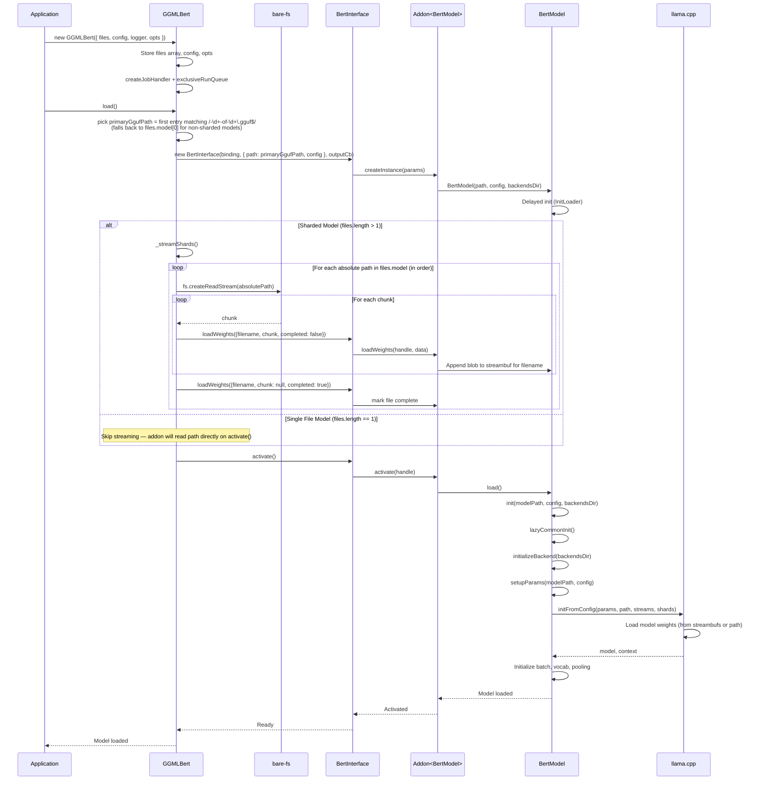
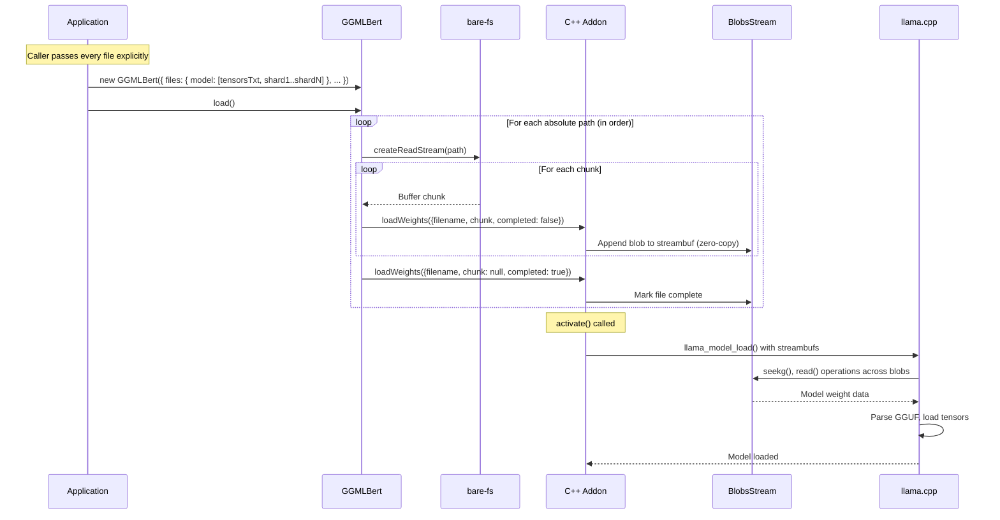
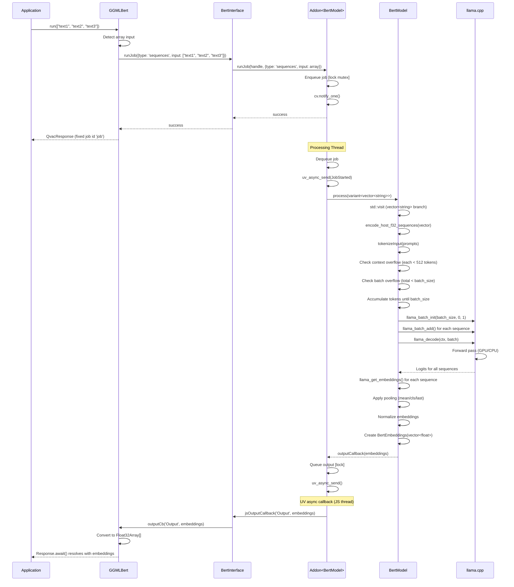
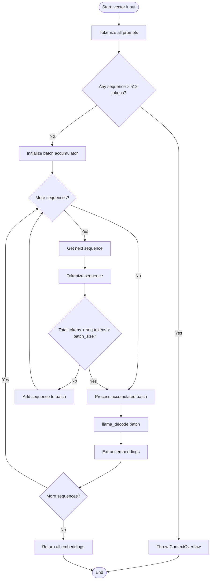
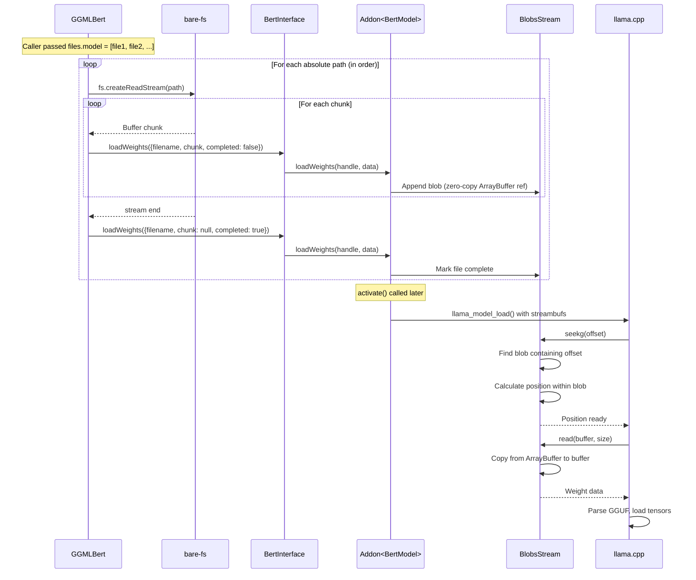
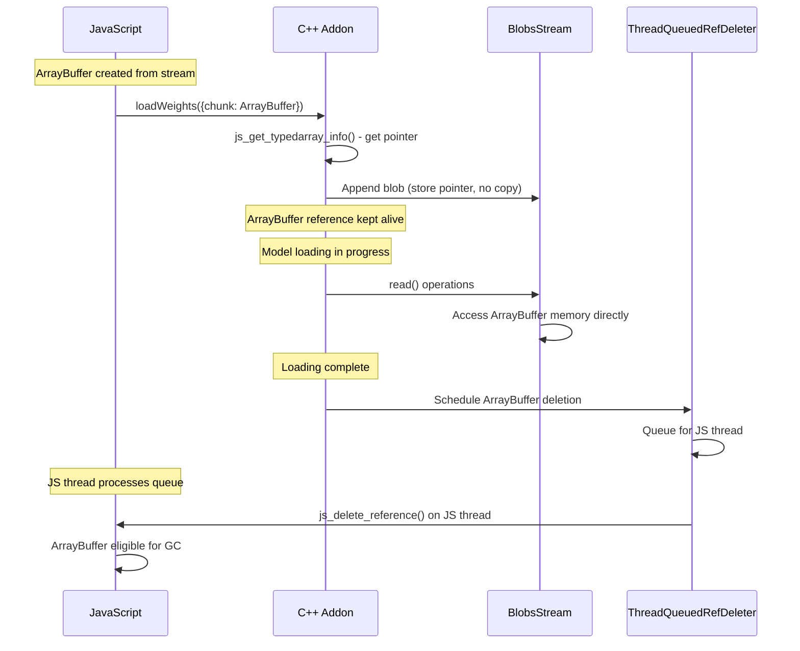
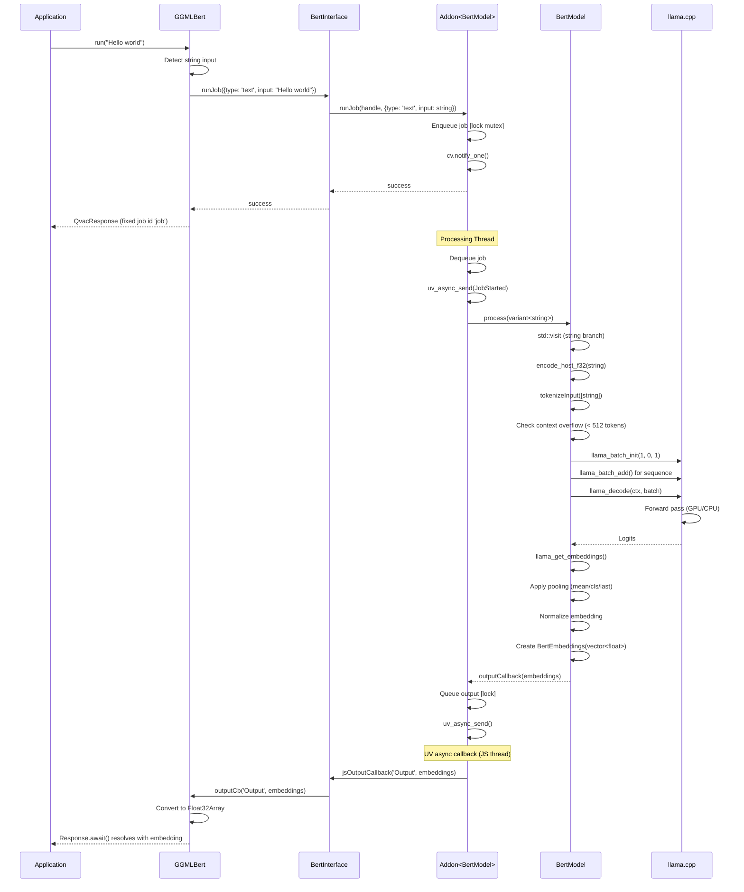
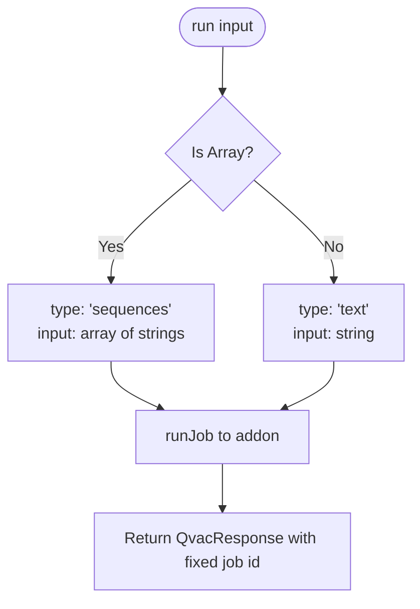
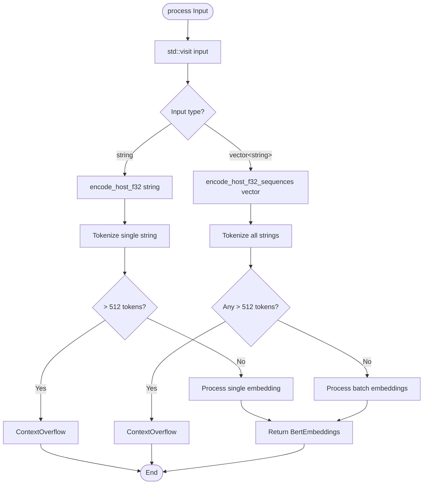

# Detailed Flow Diagrams

**⚠️ Warning:** These diagrams may become outdated as the codebase evolves. For debugging, regenerate diagrams from the actual code paths.

**Recommendation:** When investigating issues, trace through the code directly rather than relying solely on these diagrams.

---

## Table of Contents

- [Model Loading Flow](#model-loading-flow)
- [Batch Embedding Generation Flow](#batch-embedding-generation-flow)
- [Weight Streaming Flow](#weight-streaming-flow)
- [Single Text Embedding Flow](#single-text-embedding-flow)

---

## Model Loading Flow

### Complete Loading Sequence

### Caller Contract for `files.model`

- **Absolute paths only.** `GGMLBert` does not resolve relative paths or discover companion files.
- **Order matters.** For sharded GGUFs, callers pass the `.tensors.txt` companion first, then shards `00001-of-N`, `00002-of-N`, …, `N-of-N` in numeric order. The addon scans the array for the first entry matching the shard regex `/-\d+-of-\d+\.gguf$/` and uses that as the primary path handed to llama.cpp's `params.model.path`. For non-sharded single-file models, the only entry is used. The `.tensors.txt` file is consumed by the streaming layer (along with the shards) but is never the primary path.
- **All files required.** Every shard and the `.tensors.txt` file must be present in the array; missing any file will fail at load time.
- **No download step.** The addon reads bytes from disk via `bare-fs`. Distribution, caching, and integrity are the caller's responsibility.

### Sharded Model Loading Detail

---

## Batch Embedding Generation Flow

### Complete Batch Processing Sequence

### Batch Token Accumulation Detail

---

## Weight Streaming Flow

### Direct File Streaming Sequence

`GGMLBert` has no `WeightsProvider` and no data loader. It streams each caller-supplied absolute path straight from disk using `bare-fs.createReadStream` and forwards chunks to the native addon. Distribution (downloading, P2P, cache, integrity) happens entirely outside this package.

### Memory Lifecycle

---

## Single Text Embedding Flow

### Single Text Processing Sequence

---

## Input Type Detection and Routing

### JavaScript Input Detection

### C++ Input Routing

---

**Last Updated:** 2026-04-16
