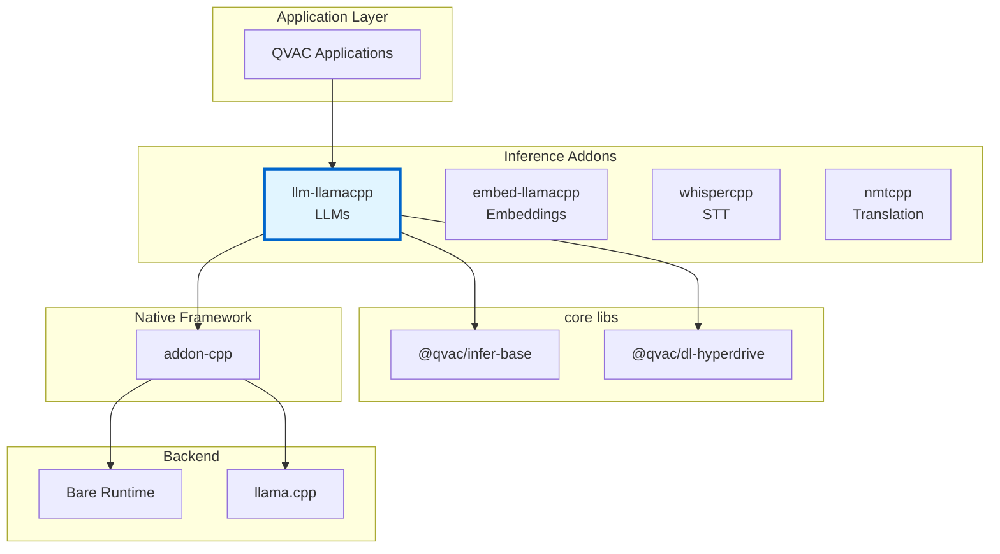
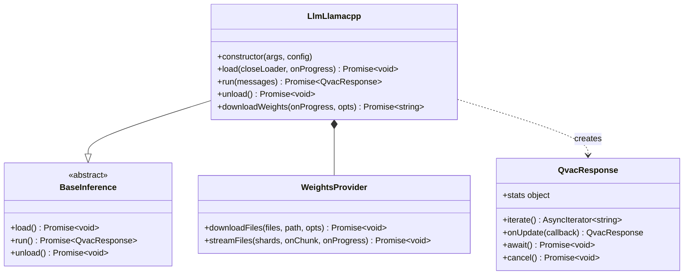
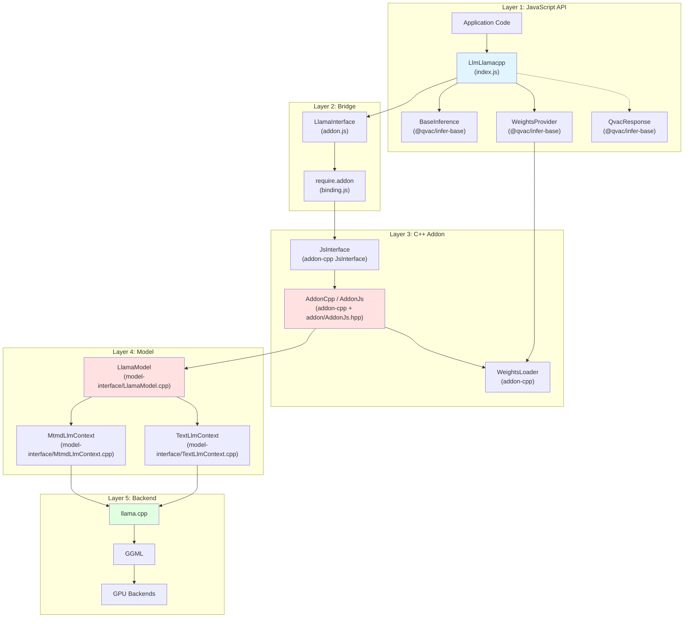
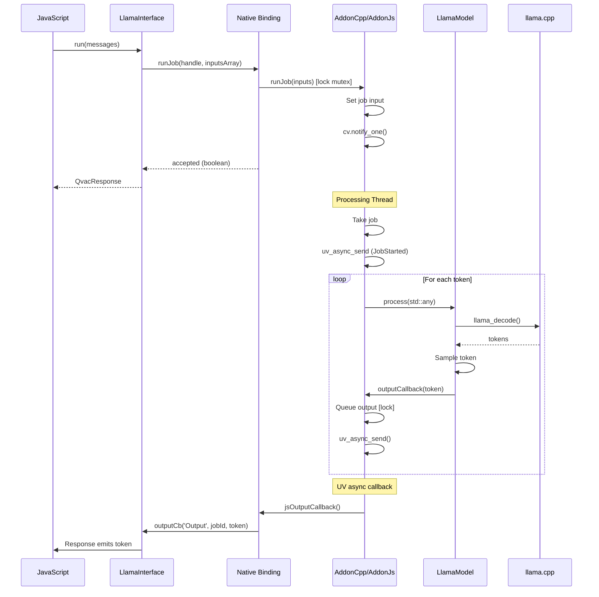

# Architecture Documentation

**Package:** `@qvac/llm-llamacpp` v0.9.0  
**Stack:** JavaScript, C++20, llama.cpp, Bare Runtime, CMake, vcpkg  
**License:** Apache-2.0

---

## Table of Contents

### Overview
- [Purpose](#purpose)
- [Key Features](#key-features)
- [Target Platforms](#target-platforms)

### Core Architecture
- [Package Context](#package-context)
- [Public API](#public-api)
- [Internal Architecture](#internal-architecture)
- [Core Components](#core-components)
- [Bare Runtime Integration](#bare-runtime-integration)

### Architecture Decisions
- [Decision 1: llama.cpp as Inference Backend](#decision-1-llamacpp-as-inference-backend)
- [Decision 2: Bare Runtime over Node.js](#decision-2-bare-runtime-over-nodejs)
- [Decision 3: Pluggable Data Loader Architecture](#decision-3-pluggable-data-loader-architecture)
- [Decision 4: Incremental Buffer-Based Weight Loading](#decision-4-incremental-buffer-based-weight-loading)
- [Decision 5: Chat Message Format](#decision-5-chat-message-format-json-serialization)
- [Decision 6: Exclusive Run Queue](#decision-6-exclusive-run-queue-indexjs)
- [Decision 7: TypeScript Definitions](#decision-7-typescript-definitions)

### Technical Debt
- [Limited Error Context](#1-limited-error-context)

---

# Overview

## Purpose

`@qvac/llm-llamacpp` is a cross-platform npm package providing Large Language Model (LLM) inference for Bare runtime applications. It wraps llama.cpp in a JavaScript-friendly API, enabling local LLM execution on desktop and mobile with CPU/GPU acceleration.

**Core value:**
- High-level JavaScript API for LLM inference
- Peer-to-peer model distribution via Hyperdrive
- Streaming token-by-token output
- Text and multimodal (vision + text) models
- Pluggable model weight loaders

## Key Features

- **Cross-platform**: macOS, Linux, Windows, iOS, Android
- **Multiple loaders**: Hyperdrive (P2P), filesystem, custom
- **Streaming responses**: Async iterators or callbacks
- **GPU acceleration**: Metal, Vulkan, OpenCL
- **Quantized models**: GGUF format
- **Multimodal**: Vision models (i.e. Qwen3-VL, SmolVLM, etc.)
- **Sharded loading**: Automatic split GGUF handling

## Target Platforms

| Platform | Architecture | Min Version | Status | GPU Support |
|----------|-------------|-------------|--------|-------------|
| macOS | arm64, x64 | 14.0+ | ✅ Tier 1 | Metal |
| iOS | arm64 | 17.0+ | ✅ Tier 1 | Metal |
| Linux | arm64, x64 | Ubuntu-22+ | ✅ Tier 1 | Vulkan |
| Android | arm64 | 12+ | ✅ Tier 1 | Vulkan, OpenCL (Adreno 700+) |
| Windows | x64 | 10+ | ✅ Tier 1 | Vulkan |

**Dependencies:**
- qvac-lib-inference-addon-cpp (≥1.1.2): C++ addon framework (single-job runner, runJob/activate/loadWeights/cancel/destroyInstance)
- llama-cpp (≥7248.1.2): Inference engine
- Bare Runtime (≥1.24.0): JavaScript runtime
- Linux requires Clang/LLVM 19 with libc++

---

# Core Architecture

## Package Context

### Ecosystem Position



<details>
<summary>📊 LLM-Friendly: Package Relationships</summary>

**Dependency Table:**

| Package | Type | Version | Purpose |
|---------|------|---------|---------|
| @qvac/infer-base | Framework | ^0.2.0 | Base classes, WeightsProvider, QvacResponse |
| @qvac/dl-hyperdrive | Peer | ^0.1.1 | P2P model loading |
| qvac-lib-inference-addon-cpp | Native | ≥1.1.1 | C++ addon framework (single-job runner) |
| llama.cpp | Native | ≥7248.1.2 | Inference engine |
| Bare Runtime | Runtime | ≥1.24.0 | JavaScript execution |

**Integration Points:**

| From | To | Mechanism | Data Format |
|------|-----|-----------|-------------|
| JavaScript | LlmLlamacpp | Constructor | args, config objects |
| LlmLlamacpp | BaseInference | Inheritance | Template method pattern |
| LlmLlamacpp | LlamaInterface | Composition | Method calls |
| LlamaInterface | C++ Addon | require.addon() | Native binding |
| WeightsProvider | Data Loader | Interface | Stream protocol |

</details>

---

## Public API

### Main Class: LlmLlamacpp



<details>
<summary>📊 LLM-Friendly: Class Responsibilities</summary>

**Component Roles:**

| Class | Responsibility | Lifecycle | Dependencies |
|-------|----------------|-----------|--------------|
| LlmLlamacpp | Orchestrate model lifecycle, manage loading/inference | Created by user, persistent | WeightsProvider, LlamaInterface |
| BaseInference | Define standard inference API | Abstract base class | None |
| QvacResponse | Stream inference output | Created per run() call, short-lived | None |
| WeightsProvider | Abstract model weight loading | Created by LlmLlamacpp | DataLoader |

**Key Relationships:**

| From | To | Type | Purpose |
|------|-----|------|---------|
| LlmLlamacpp | BaseInference | Inheritance | Standard QVAC inference API |
| LlmLlamacpp | WeightsProvider | Composition | Model weight acquisition |
| LlmLlamacpp | QvacResponse | Creates | Streaming output per inference |

</details>

---

## Internal Architecture

### Architectural Pattern

The package follows a **layered architecture** with clear separation of concerns:



<details>
<summary>📊 LLM-Friendly: Layer Responsibilities</summary>

**Layer Breakdown:**

| Layer | Components | Responsibility | Language | Why This Layer |
|-------|------------|----------------|----------|----------------|
| 1. JavaScript API | LlmLlamacpp, BaseInference | High-level API, error handling | JS | Ergonomic API for npm consumers |
| 2. Bridge | LlamaInterface, binding.js | JS↔C++ communication | JS wrapper | Lifecycle management, handle safety |
| 3. C++ Addon | JsInterface, AddonCpp/AddonJs | Single-job runner, threading, callbacks | C++ | Performance, native integration |
| 4. Model | LlamaModel, Contexts | Inference logic, chat formatting | C++ | Direct llama.cpp integration |
| 5. Backend | llama.cpp, GGML | Tensor ops, GPU kernels | C++ | Optimized inference |

**Data Flow Through Layers:**

| Direction | Path | Data Format | Transform |
|-----------|------|-------------|-----------|
| Input → | JS → Bridge → Addon | JSON string | Serialize messages |
| Input → | Addon → Model | parsed chat_msg | Parse JSON, format template |
| Input → | Model → llama.cpp | tokens | Tokenize |
| Output ← | llama.cpp → Model | token IDs | Sample |
| Output ← | Model → Addon | UTF-8 string | Decode token |
| Output ← | Addon → Bridge | string | Queue output |
| Output ← | Bridge → JS | string | Emit via callback |

</details>

---

## Core Components

### JavaScript Components

#### **LlmLlamacpp (index.js)**

**Responsibility:** Main API class, orchestrates model lifecycle, manages data loaders

**Why JavaScript:**
- High-level API ergonomics for npm consumers
- Promise/async-await integration
- Event loop integration for streaming
- Configuration parsing


#### **LlamaInterface (addon.js)**

**Responsibility:** JavaScript wrapper around native addon, manages handle lifecycle

**Why JavaScript:**
- Clean JavaScript API over raw C++ bindings
- Native handle lifecycle management
- Type conversion between JS and native

### C++ Components

#### **LlamaModel (model-interface/LlamaModel.cpp)**

**Responsibility:** Core inference implementation wrapping llama.cpp

**Why C++:**
- Direct integration with llama.cpp C API
- Performance-critical inference loop
- Memory-efficient token processing
- Native GPU backend access

#### **AddonCpp / AddonJs (addon-cpp + addon/AddonJs.hpp)**

**Responsibility:** Addon-cpp framework integration; LLM addon provides createInstance and runJob over JsInterface

**Why C++:**
- Single-job runner (one job at a time, runJob returns boolean accepted)
- Dedicated processing thread via addon-cpp JobRunner
- Thread-safe job submission and cancellation (IModelCancel)
- Output dispatching via uv_async

**LLM specialization:** createInstance builds LlamaModel with config; runJob parses inputs array (media + text) into LlamaModel::Prompt

#### **WeightsProvider (@qvac/infer-base)**

**Responsibility:** Abstracts model weight acquisition

**Why JavaScript:**
- Integrates with data loaders (Hyperdrive, filesystem)
- Progress tracking and reporting
- Handles sharded GGUF expansion
- Streaming chunk delivery

#### **CacheManager (model-interface/CacheManager.cpp)**

**Responsibility:** KV cache persistence and session management

- Saves/loads llama.cpp KV cache to disk for conversation continuity
- Handles cache invalidation on context changes
- Configurable discard policy via `n_discarded` parameter

#### **BackendSelection (utils/BackendSelection.cpp)**

**Responsibility:** GPU backend selection at runtime (Android)

- Selects between CPU, Vulkan, and OpenCL backends at runtime
- Prefers OpenCL for Adreno 700+ GPUs, Vulkan otherwise
- Supports `main-gpu` config for integrated vs dedicated GPU selection
- Metal is compiled statically into macOS/iOS binaries (no runtime selection)
- Dynamic loading currently enabled on Android only (Linux disabled due to Pear runtime compatibility)

#### **LlamaLazyInitializeBackend (model-interface/LlamaLazyInitializeBackend.cpp)**

**Responsibility:** Deferred backend initialization and dynamic library loading

- Loads GPU backend libraries (`.so`/`.dylib`) at runtime from `backendsDir`
- Enables single binary distribution with optional GPU acceleration

---

## Bare Runtime Integration

### Communication Pattern



<details>
<summary>📊 LLM-Friendly: Thread Communication</summary>

**Thread Responsibilities:**

| Thread | Runs | Blocks On | Can Call |
|--------|------|-----------|----------|
| JavaScript | App code, callbacks | Nothing (event loop) | All JS, addon methods |
| Processing | Inference | model.process() | model.*, uv_async_send() |

**Synchronization Primitives:**

| Primitive | Purpose | Held Duration | Risk |
|-----------|---------|---------------|------|
| std::mutex | Protect single job state | <1ms | Low (brief) |
| std::condition_variable | Wake processing thread | N/A | None |
| uv_async_t | Wake JS thread | N/A | None |

**Thread Safety Rules:**

1. ✅ Call addon methods from any thread (runJob, cancel, activate, loadWeights, destroyInstance)
2. ✅ Processing thread calls model methods
3. ❌ Don't call JS functions from C++ thread (use uv_async_send)
4. ❌ Don't call model methods from JS thread

</details>

---

# Architecture Decisions

## Decision 1: llama.cpp as Inference Backend

<details>
<summary>⚡ TL;DR</summary>

**Chose:** llama.cpp over MLC-LLM and other alternatives  
**Why:** Simpler integration, broader model support, mature ecosystem  
**Cost:** Large binary size, C++ build complexity, API instability

</details>

### Context

Need high-performance, cross-platform LLM inference for resource-constrained environments (laptops, mobile devices) with support for:
- Various model architectures (LLaMA, Mistral, Qwen, etc.)
- Quantization for reduced memory footprint
- GPU acceleration on diverse hardware
- Multimodal capabilities (vision + text)

### Decision

Use llama.cpp (via vcpkg) as the core inference engine instead of MLC-LLM, ONNX Runtime, or custom implementation.

### Rationale

**Performance:**
- Industry-leading inference speed through highly optimized C++ and platform-specific SIMD
- Supports 1-8 bit quantization reducing memory by 2-8x with minimal accuracy loss
- GPU acceleration via Metal (Apple) and Vulkan (cross-platform)

**Model Support:**
- Supports all major open-source LLMs and finetuned variants
- Active community adding new model support rapidly
- GGUF format is becoming de facto standard for quantized models

**Development Velocity:**
- Very active development with daily improvements
- Large community identifying and fixing issues quickly
- Comprehensive examples and documentation


### Alternatives Considered

A comprehensive evaluation was conducted comparing six inference runtimes across multiple criteria.

1. **MLC-LLM** ([github](https://github.com/mlc-ai/mlc-llm))
   - ✅ Good performance (17-18 TPS on tested platforms)
   - ✅ Multi-GPU support with tensor and pipeline parallelism
   - ❌ No CPU-only support
   - ❌ Known build errors on iOS
   - ❌ Requires model compilation for each target platform
   - ❌ More complex build system and integration

2. **ExecuTorch** ([github](https://github.com/pytorch/executorch))
   - ✅ Excellent mobile support (iOS, Android)
   - ✅ Support for embedded devices (ARM microcontrollers)
   - ❌ Metal/CoreML backends don't support dynamic input shapes (falls back to CPU-only)
   - ❌ Limited model support (mainly Llama variants)
   - ❌ Cannot finetune on device
   - ❌ Lower performance (4-12.5 TPS vs 14-21 TPS for llama.cpp)

3. **LiteRT Next** ([github](https://github.com/google-ai-edge/LiteRT))
   - ✅ Good mobile GPU support (Android)
   - ❌ First full release planned for late 2025
   - ❌ Very limited model support (only Gemma models)
   - ❌ Desktop platforms run CPU-only (GPU coming soon)
   - ❌ No clear iOS build instructions

4. **PRIMA.CPP** ([github](https://github.com/Lizonghang/prima.cpp))
   - ✅ Multi-node support with tensor parallelism
   - ✅ Competitive performance (20-21 TPS)
   - ❌ Limited platform support (Linux, macOS only)
   - ❌ No mobile support (Android, iOS)
   - ❌ Vulkan backend not yet supported
   - ❌ Smaller model ecosystem

5. **EXO** ([github](https://github.com/exo-explore/exo))
   - ✅ Interesting distributed training capabilities
   - ✅ Uses MLX on Apple and Tinygrad
   - ❌ Multiple bugs preventing reliable execution
   - ❌ Not production-ready
   - ❌ No multi-GPU support
   - ❌ Limited model support

**Why llama.cpp Won:**
- Broadest platform support (desktop + mobile, all major OSes)
- Most extensive model ecosystem (GGUF is de facto standard)
- Best balance of performance and memory efficiency across platforms
- Mature, production-ready with active development
- Simpler integration (no model compilation step)
- Memory-mapped weights reduce RAM usage significantly
- RPC backend for multi-node inference (work in progress)

---

## Decision 2: Bare Runtime over Node.js

See [qvac-lib-inference-addon-cpp Decision 4: Why Bare Runtime](https://github.com/tetherto/qvac-lib-inference-addon-cpp/blob/main/docs/architecture.md#decision-4-why-bare-runtime) for rationale.

**Summary:** Mobile support (iOS/Android), lightweight, modern addon API. Core business logic remains runtime-agnostic.

---

## Decision 3: Pluggable Data Loader Architecture

<details>
<summary>⚡ TL;DR</summary>

**Chose:** Abstract data loading via WeightsProvider interface  
**Why:** Support multiple distribution methods (P2P, HTTP, local files, S3)  
**Cost:** Additional abstraction layer, must implement loader interface

</details>

### Context

Need to load multi-GB model files from various sources:
- Local filesystem (for offline/development)
- P2P networks (for privacy/decentralization)
- HTTP/CDN (for enterprise deployments)
- Cloud storage (S3, Azure Blob, etc.)

Different use cases have different distribution requirements. No single distribution method fits all scenarios.

### Decision

Create a pluggable data loader abstraction (WeightsProvider interface) that decouples model loading from the inference engine, allowing applications to choose their distribution strategy.

### Rationale

**Flexibility:**
- Different users have different distribution needs (privacy vs speed vs simplicity)
- Enterprises may require HTTP/CDN, privacy users may prefer P2P
- Development/testing needs local filesystem access
- No single distribution method fits all use cases

**Separation of Concerns:**
- Inference engine doesn't need to know about distribution details
- Model loading is orthogonal to inference logic
- Easier to test inference separately from data loading

**Extensibility:**
- Applications can implement custom loaders (S3, IPFS, Torrent, etc.)
- Can optimize loaders for specific platforms (mobile vs desktop)
- Future-proof: new distribution methods don't require engine changes

### Trade-offs
- ✅ Can mock loaders for unit testing inference logic
- ❌ Additional abstraction complexity vs hardcoding a single method
- ❌ Applications must choose/implement their loader (no batteries-included default)

### WeightsProvider Interface

```javascript
// Core abstraction that all loaders must implement
interface WeightsProvider {
  // Get readable stream for model file
  async getStream(path: string): ReadableStream
  
  // Wait for loader to be ready
  async ready(): Promise<void>
  
  // Cleanup resources
  async close(): Promise<void>
}
```

### Example Implementations

<details>
<summary>📊 LLM-Friendly: Loader Comparison</summary>

**Performance Characteristics:**

| Loader | Use Case | Initial Download | Subsequent Access | Setup Complexity |
|--------|----------|------------------|-------------------|------------------|
| **FileSystemDataLoader** | Development, offline | Instant | Instant | Low (just file path) |
| **HyperdriveDataLoader** | Privacy, P2P | 10-100 MB/s | Instant (cached) | Medium (P2P keys) |
| **HttpDataLoader** | Enterprise, CDN | 50-500 MB/s | Varies | Low (just URL) |
| **S3DataLoader** | Cloud deployments | 50-200 MB/s | Varies | Medium (AWS credentials) |

**Example: Local Filesystem Loader**
```javascript
class FileSystemDataLoader {
  constructor(basePath) { this.basePath = basePath }
  
  async getStream(path) {
    return fs.createReadStream(`${this.basePath}/${path}`)
  }
  async ready() { /* no-op */ }
  async close() { /* no-op */ }
}
```

**Example: HTTP/CDN Loader**
```javascript
class HttpDataLoader {
  constructor(baseUrl) { this.baseUrl = baseUrl }
  
  async getStream(path) {
    const response = await fetch(`${this.baseUrl}/${path}`)
    return response.body
  }
  async ready() { /* no-op */ }
  async close() { /* no-op */ }
}
```

**Example: Hyperdrive (P2P) Loader**
```javascript
class HyperdriveDataLoader {
  constructor(key) { 
    this.drive = new Hyperdrive(key)
  }
  
  async getStream(path) {
    return this.drive.createReadStream(path)
  }
  async ready() {
    await this.drive.ready()
  }
  async close() {
    await this.drive.close()
  }
}
```

</details>

---

## Decision 4: Incremental Buffer-Based Weight Loading

<details>
<summary>⚡ TL;DR</summary>

**Chose:** Buffer-based weight loader using custom std::streambuf over JavaScript ArrayBuffers  
**Why:** Avoid storage duplication, zero-copy, supports incremental shard-by-shard loading  
**Cost:** Complex streambuf implementation, JavaScript reference lifecycle management

</details>

### Context

ML models can be gigabytes in size. llama.cpp expects either:
1. A file descriptor (simple but requires file on disk)
2. A buffer (via `std::streambuf` interface)

**Problem:** We need to load directly from Hyperdrive (P2P storage) without duplicating storage by saving to disk first.

Alternative approach would be: download from Hyperdrive → save to temp file → pass file descriptor to llama.cpp. But this doubles storage requirements (Hyperdrive cache + temp file).

### Decision

Implement custom `std::streambuf` over JavaScript-owned ArrayBuffers with incremental shard-by-shard loading, as provided by `qvac-lib-inference-addon-cpp` framework. This allows feeding buffer chunks from any source (Hyperdrive, HTTP, local files) directly to llama.cpp without intermediate file storage.

JavaScript sends model data as buffer chunks, C++ wraps them in a `std::streambuf`, enabling llama.cpp to load sharded models incrementally with zero-copy access to JavaScript memory. See our [llama.cpp fork implementation](https://github.com/tetherto/qvac-ext-lib-llama.cpp/compare/master...tetherto:qvac-ext-lib-llama.cpp:temp-load-from-buffer?diff=unified&w).

### Rationale

**Avoid Storage Duplication:**
- Load directly from Hyperdrive streams without saving to disk first
- No temporary files consuming additional storage
- Critical for mobile devices with limited storage
- Hyperdrive data stays in its cache, not duplicated

**Zero-Copy:**
- C++ reads directly from JavaScript ArrayBuffer memory
- No memcpy of multi-GB model files
- Further reduces memory footprint

**Source Flexibility:**
- Works with any data source (Hyperdrive, HTTP, filesystem)
- Data loader provides buffer chunks, streambuf wrapper handles delivery to llama.cpp
- Same incremental loading path for all distribution methods
- Supports sharded GGUF files with incremental tensor loading

### Trade-offs
- ✅ Can report loading progress per chunk
- ❌ Complex streambuf implementation with seeking across blobs
- ❌ Must keep JS buffers alive during load, defer cleanup to correct thread
- ❌ Seeking overhead O(N) across N blobs (acceptable, rarely needed)

**Key Components:**
- `WeightsProvider` (JavaScript): Orchestrates chunk delivery
- `BlobsStream` (C++): Implements `std::basic_streambuf<char>` over multiple blobs
- `FinalizedStream` (C++): RAII wrapper owning JavaScript references
- `ThreadQueuedRefDeleter` (C++): Defers reference deletion to JavaScript thread

See [Weight Loading Flow](data-flows-detailed.md#weight-loading-flow) for detailed sequence diagram and memory lifecycle.

---

## Decision 5: Chat Message Format (JSON Serialization)

<details>
<summary>⚡ TL;DR</summary>

**Chose:** Serialize chat messages to JSON string before crossing JS/C++ boundary  
**Why:** Simple marshalling, OpenAI API compatible, extensible  
**Cost:** JSON parsing overhead per inference call

</details>

### Context

Need to pass multi-turn conversation history from JavaScript to C++ for processing. Messages contain role, content, and potentially metadata.

### Decision

Serialize chat messages array to JSON string before passing to C++, rather than marshalling complex object graphs.

### Rationale

**Simplicity:**
- Single string parameter instead of complex nested objects
- JSON parsing well-supported in both JavaScript and C++ (picojson)
- No custom serialization format needed

**Compatibility:**
- Matches OpenAI chat completion API format
- Easy for developers familiar with GPT APIs
- Compatible with LangChain, LlamaIndex patterns

**Extensibility:**
- Easy to add new message fields without changing C++ interface
- Tool/function calling support via additional fields

### Trade-offs
- ✅ JSON parsing available everywhere (portable)
- ❌ Serialization overhead on every call
- ❌ No compile-time type checking across JS/C++ boundary
- ❌ Must serialize full history each time (no streaming)

**Note:** Alternative approaches (FlatBuffers, Protocol Buffers, custom binary) were not evaluated. The drawbacks above are not significant concerns; JSON's simplicity and OpenAI API compatibility take priority.


---

## Decision 6: Exclusive Run Queue (index.js)

<details>
<summary>⚡ TL;DR</summary>

**Chose:** Promise-based exclusive run queue using `_withExclusiveRun()` wrapper  
**Why:** Ensure atomic multi-step operations (text + media + end-of-input) complete without interruption  
**Cost:** One inference request at a time per model instance

</details>

### Context

A single inference request sends one `runJob(inputs)` call with an array of inputs:
1. Zero or more `{ type: 'media', content: Uint8Array }` - Image/audio data
2. One `{ type: 'text', input: JSON.stringify(messages) }` - Chat history

Without coordination, concurrent requests could call `runJob()` while a job is already set or running; the addon returns `false` (not accepted) in that case.

### Decision

Implement JavaScript-level promise queue using `_withExclusiveRun()` helper that ensures only one runJob is in flight at a time. A second `run()` during an active job first waits a short window for the previous job to settle, then fails with a consistent busy error if the second run is not accepted:
- `"Cannot set new job: a job is already set or being processed"`

**Note:** C++ level thread safety (single-job runner with mutex-protected job state, optional IModelCancel) is handled by the addon-cpp 1.1.x framework; see addon-cpp docs for architecture and decisions.

### Rationale

**Atomicity:**
- Ensures multi-part messages (media + text + end-of-input) are sent as complete units
- Prevents another request from inserting messages mid-stream
- Each request gets exclusive run so only one runJob is in flight at a time

**Message Integrity:**
- Model receives coherent message sequences
- Media data paired with correct text prompt
- No mixing of data from concurrent requests

### Trade-offs
- ✅ Simple promise-based queue (no complex locking)
- ✅ Predictable sequential execution order
- ❌ One request at a time per model instance
- ❌ Head-of-line blocking (long request delays subsequent ones)

**Mitigation:** Create multiple model instances for parallel requests

---

## Decision 7: TypeScript Definitions

<details>
<summary>⚡ TL;DR</summary>

**Chose:** Hand-written TypeScript definitions (index.d.ts)  
**Why:** Type safety, IDE support, API documentation  
**Cost:** Manual maintenance, must keep in sync with implementation

</details>

### Context

Many developers use TypeScript. Need to provide type information for better developer experience, IDE autocomplete, and compile-time error checking.

### Decision

Provide hand-written TypeScript definitions in `index.d.ts` alongside JavaScript implementation.

### Rationale

**Developer Experience:**
- IDE autocomplete for methods and parameters
- Compile-time error checking
- Inline documentation in tooltips
- Type inference for response objects

**Documentation:**
- Types serve as living API documentation
- Clear contracts for all public methods
- Parameter descriptions and constraints

### Trade-offs
- ✅ Catch errors at compile time
- ✅ Refactor/rename symbols safely with IDE support
- ❌ Maintenance burden (must keep .d.ts in sync with .js)
- ❌ Some dynamic behaviors hard to type (partial coverage)

**Mitigation:** Test with `npm run test:dts` (runs `tsc --noEmit`)

---

# Technical Debt

### 1. Limited Error Context
**Status:** C++ exceptions lose stack traces crossing JS boundary  
**Issue:** Generic error messages make debugging difficult  
**Root Cause:** Bare's `js.h` doesn't support error stacks  
**Plan:** Implement structured error objects with error codes and context

---

**Related Document:**
- [data-flows-detailed.md](data-flows-detailed.md) - Detailed data flow diagrams and sequences

**Last Updated:** 2026-02-17
