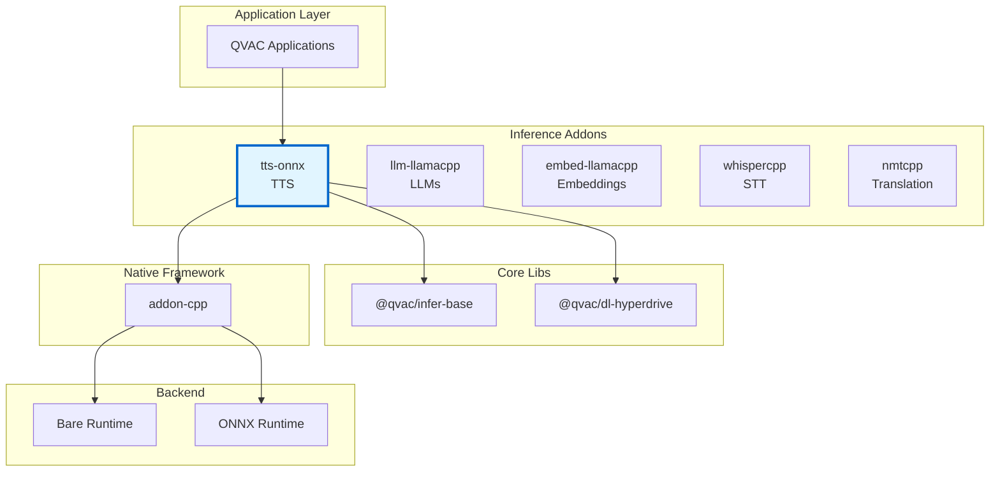
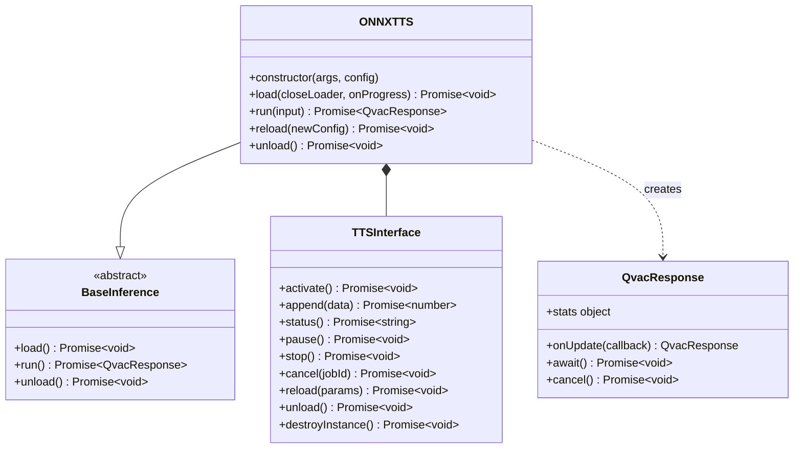
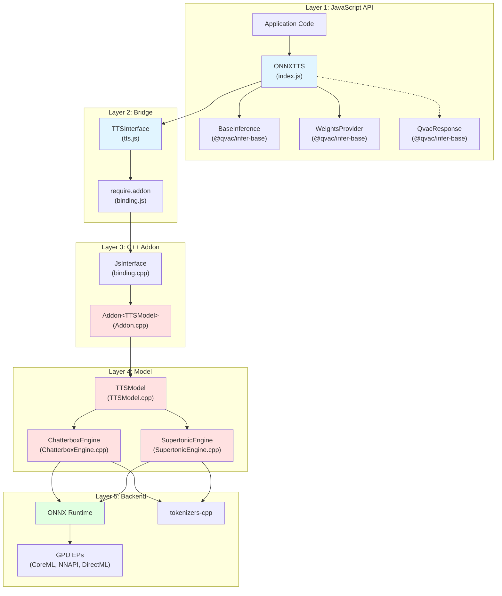
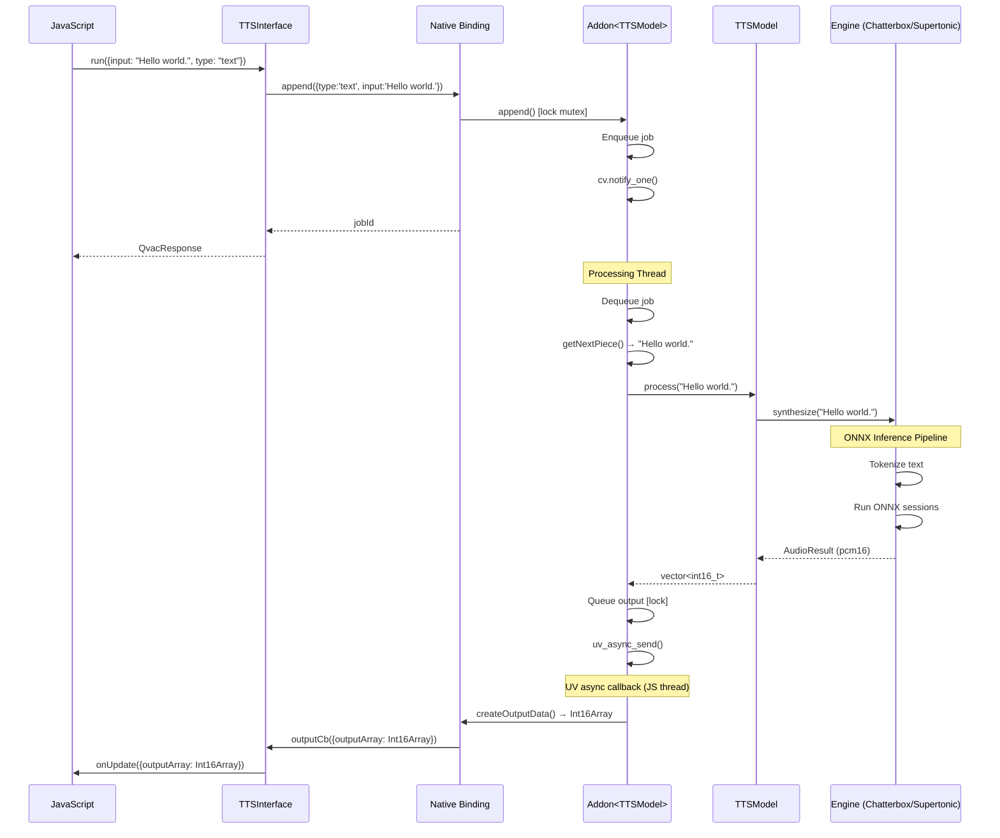

# Architecture Documentation

**Package:** `@qvac/tts-onnx` v0.5.0  
**Stack:** JavaScript, C++20, ONNX Runtime, Bare Runtime, CMake, vcpkg  
**License:** Apache-2.0

---

## Table of Contents

### Overview
- [Purpose](#purpose)
- [Key Features](#key-features)
- [Target Platforms](#target-platforms)

### Core Architecture
- [Package Context](#package-context)
- [Public API](#public-api)
- [Internal Architecture](#internal-architecture)
- [Core Components](#core-components)
- [Bare Runtime Integration](#bare-runtime-integration)

### Architecture Decisions
- [Decision 1: ONNX Runtime as Inference Backend](#decision-1-onnx-runtime-as-inference-backend)
- [Decision 2: Bare Runtime over Node.js](#decision-2-bare-runtime-over-nodejs)
- [Decision 3: Dual-Engine Architecture (Chatterbox + Supertonic)](#decision-3-dual-engine-architecture-chatterbox--supertonic)
- [Decision 4: File-Based Model Loading](#decision-4-file-based-model-loading)
- [Decision 5: Sentence-Level Streaming Output](#decision-5-sentence-level-streaming-output)
- [Decision 6: TypeScript Definitions](#decision-6-typescript-definitions)

### Technical Debt
- [Inconsistent ONNX Session Abstraction](#1-inconsistent-onnx-session-abstraction)
- [Limited Error Context](#2-limited-error-context)

---

# Overview

## Purpose

`@qvac/tts-onnx` is a cross-platform npm package providing Text-to-Speech inference for Bare runtime applications. It wraps ONNX Runtime in a JavaScript-friendly API, enabling local TTS execution on desktop and mobile with platform-specific GPU acceleration. The package supports two open-source synthesis engines — Chatterbox (high-quality voice cloning) and Supertonic (faster-than-realtime synthesis) — allowing consumers to choose the quality/speed trade-off that fits their use case.

**Core value:**
- Unified JavaScript API for dual-engine TTS inference
- Cross-platform native inference via ONNX Runtime with hardware-specific acceleration (CoreML, NNAPI, DirectML)
- Model distribution via Hyperdrive (P2P) or filesystem with pluggable data loaders
- Sentence-level streaming audio output for responsive UX
- Voice cloning via reference audio (Chatterbox engine)

## Key Features

- **Dual-engine TTS**: Chatterbox for high-quality voice cloning, Supertonic for faster-than-realtime synthesis
- **Cross-platform**: macOS, Linux, Windows, iOS, Android with platform-specific GPU acceleration
- **Multiple loaders**: Hyperdrive (P2P), filesystem, custom data loaders via `@qvac/infer-base`
- **Streaming output**: Sentence-level audio chunks delivered via callbacks as Int16Array PCM data
- **Multi-language**: Chatterbox (en, es, fr, de, it, pt, ru), Supertonic (en, ko, es, pt, fr)
- **Voice cloning**: Reference audio input for speaker-adaptive synthesis (Chatterbox)
- **Configurable quality**: Supertonic denoising steps and speed parameters for quality/latency trade-off

## Target Platforms

| Platform | Architecture | Min Version | Status | GPU Support |
|----------|-------------|-------------|--------|-------------|
| macOS | arm64, x64 | 14.0+ | ✅ Tier 1 | CoreML |
| iOS | arm64 | 17.0+ | ✅ Tier 1 | CoreML |
| Linux | arm64, x64 | Ubuntu-22+ | ✅ Tier 1 | CUDA, ROCm |
| Android | arm64 | 12+ | ✅ Tier 1 | NNAPI |
| Windows | x64 | 10+ | ✅ Tier 1 | DirectML, CUDA |

**Dependencies:**
- qvac-lib-inference-addon-cpp (=0.12.2): C++ addon framework
- ONNX Runtime: Inference engine (platform-specific EP builds via vcpkg)
- tokenizers-cpp (≥0.1.1#2): HuggingFace tokenizer C bindings
- Bare Runtime (≥1.19.0): JavaScript runtime

---

# Core Architecture

## Package Context

### Ecosystem Position

📊 LLM-Friendly: Package Relationships

**Dependency Table:**

| Package | Type | Version | Purpose |
|---------|------|---------|---------|
| @qvac/infer-base | Framework | ^0.1.0 | Base classes, WeightsProvider, QvacResponse |
| @qvac/dl-hyperdrive | Peer | ^0.1.0 | P2P model loading |
| @qvac/error | Runtime | ^0.1.0 | Structured error handling |
| qvac-lib-inference-addon-cpp | Native | =0.12.2 | C++ addon framework |
| ONNX Runtime | Native | via vcpkg | Inference engine |
| tokenizers-cpp | Native | ≥0.1.1#2 | HuggingFace tokenizer |
| Bare Runtime | Runtime | ≥1.19.0 | JavaScript execution |

**Integration Points:**

| From | To | Mechanism | Data Format |
|------|-----|-----------|-------------|
| JavaScript | ONNXTTS | Constructor | args, config objects |
| ONNXTTS | BaseInference | Inheritance | Template method pattern |
| ONNXTTS | TTSInterface | Composition | Method calls |
| TTSInterface | C++ Addon | require.addon() | Native binding |
| WeightsProvider | Data Loader | Interface | File download protocol |

---

## Public API

### Main Class: ONNXTTS

📊 LLM-Friendly: Class Responsibilities

**Component Roles:**

| Class | Responsibility | Lifecycle | Dependencies |
|-------|----------------|-----------|--------------|
| ONNXTTS | Orchestrate model lifecycle, engine detection, weight management | Created by user, persistent | WeightsProvider, TTSInterface |
| BaseInference | Define standard inference API (load/run/unload) | Abstract base class | None |
| QvacResponse | Stream inference output via callbacks | Created per run() call, short-lived | None |
| TTSInterface | JS wrapper around native binding, error translation | Created by ONNXTTS during load | Native binding |
| WeightsProvider | Abstract model weight loading from data loaders | Created by ONNXTTS | DataLoader |

**Key Relationships:**

| From | To | Type | Purpose |
|------|-----|------|---------|
| ONNXTTS | BaseInference | Inheritance | Standard QVAC inference API |
| ONNXTTS | TTSInterface | Composition | Native addon lifecycle management |
| ONNXTTS | QvacResponse | Creates | Streaming audio output per inference |
| ONNXTTS | WeightsProvider | Composition | Model file acquisition |

---

## Internal Architecture

### Architectural Pattern

The package follows a **layered architecture** with clear separation of concerns:

📊 LLM-Friendly: Layer Responsibilities

**Layer Breakdown:**

| Layer | Components | Responsibility | Language | Why This Layer |
|-------|------------|----------------|----------|----------------|
| 1. JavaScript API | ONNXTTS, BaseInference | High-level API, engine detection, error handling | JS | Ergonomic API for npm consumers |
| 2. Bridge | TTSInterface, binding.js | JS↔C++ communication, handle lifecycle | JS wrapper | Error translation, lifecycle management |
| 3. C++ Addon | JsInterface, Addon&lt;TTSModel&gt; | Job queue, threading, output dispatch | C++ | Performance, native integration |
| 4. Model | TTSModel, ChatterboxEngine, SupertonicEngine | Engine-specific inference pipelines | C++ | Direct ONNX Runtime integration |
| 5. Backend | ONNX Runtime, tokenizers-cpp | Tensor ops, GPU execution | C++ | Optimized model inference |

**Data Flow Through Layers:**

| Direction | Path | Data Format | Transform |
|-----------|------|-------------|-----------|
| Input → | JS → Bridge → Addon | {type, input} object | Extract text string |
| Input → | Addon → TTSModel | std::string | Split into sentences |
| Input → | TTSModel → Engine | std::string | Tokenize → tensor |
| Output ← | Engine → TTSModel | AudioResult (vector&lt;int16_t&gt;) | PCM samples |
| Output ← | TTSModel → Addon | vector&lt;int16_t&gt; | Queue output |
| Output ← | Addon → Bridge | Int16Array | memcpy to JS ArrayBuffer |
| Output ← | Bridge → JS | {outputArray: Int16Array} | Emit via callback |

---

## Core Components

### JavaScript Components

#### **ONNXTTS (index.js)**

**Responsibility:** Main API class, engine auto-detection, model lifecycle orchestration, weight downloading

**Why JavaScript:**
- High-level API ergonomics for npm consumers
- Engine detection logic based on constructor arguments (Supertonic if `textEncoderPath` or `modelDir+voiceName` provided)
- Promise/async-await integration for loading and inference
- Path resolution with platform-specific handling (Windows long path prefix)

#### **TTSInterface (tts.js)**

**Responsibility:** JavaScript wrapper around native addon, error translation to `QvacErrorAddonTTS`

**Why JavaScript:**
- Clean JavaScript API over raw C++ bindings
- Maps all native errors to typed `QvacErrorAddonTTS` with error codes 7001–7010
- Native handle lifecycle management (null-check on destroy)

#### **addonLogging (addonLogging.js)**

**Responsibility:** Bridge for routing C++ log output through JavaScript logger callbacks

**Why JavaScript:**
- Allows applications to integrate native logging with their logging framework
- Simple `setLogger`/`releaseLogger` API forwarded to native binding

### C++ Components

#### **Addon&lt;TTSModel&gt; (addon/Addon.cpp)**

**Responsibility:** Template specialization of addon-cpp framework for TTS

**Why C++:**
- Provides job queue and dedicated processing thread
- Thread-safe state machine (IDLE → LOADING → LISTENING → PROCESSING)
- Output dispatching via `uv_async_send`

**Specializations:**
- `getNextPiece()`: Splits input text on sentence boundaries (`.!?`) with minimum 25-character pieces for streaming UX
- `loadWeights()`: No-op (TTS loads models from file paths, not streamed buffers)
- `createOutputData()`: Copies `vector<int16_t>` into JS Int16Array via ArrayBuffer

#### **TTSModel (model-interface/TTSModel.cpp)**

**Responsibility:** Engine abstraction layer — dispatches to Chatterbox or Supertonic based on configuration

**Why C++:**
- Unified `process(text)` interface regardless of engine
- Engine detection from config map at construction time
- Runtime statistics tracking (totalTime, tokensPerSecond, realTimeFactor, audioDurationMs, totalSamples)

#### **ChatterboxEngine (model-interface/ChatterboxEngine.cpp)**

**Responsibility:** Chatterbox TTS inference pipeline — multi-model autoregressive synthesis with voice cloning

**Why C++:**
- Manages four ONNX sessions (speech encoder, embed tokens, language model, conditional decoder)
- Autoregressive language model loop requires tight performance
- Tokenization via `tokenizers_c.h` C API (needed for `add_special_tokens` support)
- Output: 24 kHz, 16-bit PCM, mono

#### **SupertonicEngine (model-interface/SupertonicEngine.cpp)**

**Responsibility:** Supertonic TTS inference pipeline — non-autoregressive diffusion-based synthesis

**Why C++:**
- Manages three ONNX sessions (text encoder, latent denoiser, voice decoder)
- Iterative latent denoising loop (configurable steps, default 5)
- Voice style loading from `.bin` files
- Output: 44.1 kHz, 16-bit PCM, mono

#### **OnnxInferSession (model-interface/OnnxInferSession.cpp)**

**Responsibility:** ONNX Runtime session wrapper with tensor management

**Why C++:**
- Abstracts `Ort::Session` with named input/output tensor access
- Manages tensor lifecycle (allocation, shape initialization, memory)
- Used by Chatterbox engine; Supertonic uses `Ort::Session` directly (see [Technical Debt #1](#1-inconsistent-onnx-session-abstraction))

---

## Bare Runtime Integration

### Communication Pattern

📊 LLM-Friendly: Thread Communication

**Thread Responsibilities:**

| Thread | Runs | Blocks On | Can Call |
|--------|------|-----------|----------|
| JavaScript | App code, callbacks, output handling | Nothing (event loop) | All JS, addon methods |
| Processing | ONNX inference, tokenization | model.process() / Engine.synthesize() | model.*, uv_async_send() |

**Synchronization Primitives:**

| Primitive | Purpose | Held Duration | Risk |
|-----------|---------|---------------|------|
| std::mutex | Protect job queue | <1ms | Low (brief) |
| std::condition_variable | Wake processing thread | N/A | None |
| uv_async_t | Wake JS thread for output delivery | N/A | None |

**Thread Safety Rules:**

1. ✅ Call addon methods (append, cancel, status) from JS thread
2. ✅ Processing thread calls model/engine methods
3. ❌ Don't call JS functions from C++ thread (use uv_async_send)
4. ❌ Don't call model methods from JS thread

---

# Architecture Decisions

## Decision 1: ONNX Runtime as Inference Backend

⚡ TL;DR

**Chose:** ONNX Runtime over TensorRT, PyTorch Mobile, CoreML-only  
**Why:** Broadest platform support with a single model format; covers models not supported by llama.cpp  
**Cost:** Large binary size, complex vcpkg build configuration per platform

### Context

QVAC needs TTS inference across all target platforms (macOS, iOS, Linux, Android, Windows). The TTS models used (Chatterbox, Supertonic) are exported from PyTorch and are not in GGUF format, so llama.cpp cannot serve them. A runtime is needed that can execute ONNX models with GPU acceleration on every platform.

### Decision

Use ONNX Runtime as the inference backend with platform-specific execution providers configured via vcpkg feature flags.

### Rationale

**Platform Coverage:**
- Single model format (`.onnx`) works across all platforms without re-compilation
- Platform-specific EPs (CoreML for Apple, NNAPI for Android, DirectML for Windows) provide GPU acceleration without code changes
- CPU fallback available everywhere

**Ecosystem Fit:**
- ONNX is the standard interchange format for PyTorch-exported models
- Used by other QVAC packages with similar constraints (models not supported by llama.cpp)
- Active community and broad model zoo support

**Integration:**
- Static linking via vcpkg simplifies distribution (single native addon binary)
- C++ API integrates cleanly with addon-cpp framework
- Session-based API matches the multi-model pipeline pattern needed for TTS

### Trade-offs
- ✅ One model format for all platforms
- ✅ Hardware-accelerated inference on every target platform
- ✅ Well-supported by ML framework exporters (PyTorch, TensorFlow)
- ❌ Large static binary (ONNX Runtime + protobuf + flatbuffers + re2)
- ❌ Complex per-platform vcpkg configuration (feature flags, triplet overrides)
- ❌ Android builds require stripping debug symbols from vendored libraries to manage size

---

## Decision 2: Bare Runtime over Node.js

See [qvac-lib-inference-addon-cpp Decision 4: Why Bare Runtime](https://github.com/tetherto/qvac-lib-inference-addon-cpp/blob/main/docs/architecture.md#decision-4-why-bare-runtime) for rationale.

**Summary:** Mobile support (iOS/Android), lightweight, modern addon API. Core business logic remains runtime-agnostic.

---

## Decision 3: Dual-Engine Architecture (Chatterbox + Supertonic)

⚡ TL;DR

**Chose:** Support both Chatterbox and Supertonic engines behind a unified API  
**Why:** Different use cases demand different quality/speed trade-offs; users choose what fits  
**Cost:** Two inference pipelines to maintain, engine-specific configuration paths

### Context

TTS applications have fundamentally different requirements depending on context:
- **Quality-critical** scenarios (audiobook narration, accessibility) need the best synthesis quality available, even if slower
- **Latency-critical** scenarios (conversational AI, real-time assistants) need faster-than-realtime synthesis, even with some quality trade-off

No single open-source TTS engine satisfies both. Chatterbox produces high-quality speech with voice cloning but is slower. Supertonic achieves faster-than-realtime synthesis but with lower quality.

### Decision

Support both engines through a unified `ONNXTTS` class with automatic engine detection based on constructor arguments. Chatterbox is selected when speech encoder / language model paths are provided; Supertonic is selected when `textEncoderPath` or `modelDir + voiceName` is provided.

### Rationale

**User Choice:**
- Consumers select the engine that matches their use case without changing API patterns
- Same `load() → run() → unload()` lifecycle regardless of engine
- Configuration-driven engine selection, no code branching needed in application layer

**Architecture Reuse:**
- Both engines share the addon-cpp framework (job queue, threading, state machine)
- Both use ONNX Runtime as the inference backend
- Both use tokenizers-cpp for text tokenization
- `TTSModel` provides a unified `process()` interface dispatching to the active engine

**Independent Evolution:**
- Engines can be updated or replaced independently
- Interface segregation (`IChatterboxEngine`, `ISupertonicEngine`) enables mocking for tests
- New engines can be added by implementing the same pattern

### Trade-offs
- ✅ Covers both quality-first and speed-first use cases
- ✅ Shared infrastructure (addon framework, ONNX Runtime, tokenizer)
- ✅ Testable via engine interface mocks
- ❌ Two distinct inference pipelines to maintain
- ❌ Engine-specific configuration fields in constructor
- ❌ Different audio output formats (Chatterbox: 24 kHz, Supertonic: 44.1 kHz) — consumers must handle both

---

## Decision 4: File-Based Model Loading

⚡ TL;DR

**Chose:** Download model files to disk, pass file paths to ONNX Runtime  
**Why:** ONNX Runtime's session API loads from file paths natively; avoids buffer-streaming complexity  
**Cost:** Requires local disk space for model files; no zero-copy loading from P2P

### Context

ONNX Runtime's `Ort::Session` constructor accepts either a file path or an in-memory buffer. The `@qvac/llm-llamacpp` package implements a zero-copy buffer streaming approach via custom `std::streambuf` to avoid disk duplication. For TTS, the same question arises: should models be loaded from disk or streamed from memory?

### Decision

Download model files to local disk via `WeightsProvider.downloadFiles()`, then pass resolved file paths to ONNX Runtime session constructors. The `loadWeights()` addon-cpp hook is a no-op.

### Rationale

**Simplicity:**
- ONNX Runtime's file-path loading is well-tested and handles memory mapping internally
- No custom streambuf implementation needed
- Multiple model files (4–5 per engine) would require complex orchestration for buffer-based loading

**Practical Fit:**
- TTS model files are smaller than LLM weights (hundreds of MB vs multi-GB)
- Disk space impact is acceptable for the model sizes involved
- File-based loading simplifies reload — just re-read from disk

### Trade-offs
- ✅ Simpler implementation — no custom buffer management
- ✅ ONNX Runtime can memory-map files internally for efficiency
- ✅ Models persist on disk for offline use after first download
- ❌ Requires local disk space (Hyperdrive cache + downloaded files)
- ❌ No zero-copy loading from P2P streams

---

## Decision 5: Sentence-Level Streaming Output

⚡ TL;DR

**Chose:** Split input text on sentence boundaries and deliver audio per sentence  
**Why:** Users hear the first audio sooner, improving perceived responsiveness  
**Cost:** Sentence boundary detection is heuristic; sub-optimal splits possible

### Context

TTS synthesis of a full paragraph takes significant time. Without streaming, the user must wait for the entire text to be synthesized before hearing anything.

### Decision

The `getNextPiece()` specialization splits input text on sentence-ending punctuation (`.!?`) with a minimum piece size of 25 characters. Each sentence is synthesized independently and its audio delivered via callback, allowing the application to play audio while remaining sentences are still being processed.

### Rationale

**User Experience:**
- First audio chunk arrives after synthesizing only the first sentence
- Perceived latency is dramatically lower than waiting for full synthesis
- Consistent with how humans read text aloud — sentence by sentence

**Implementation:**
- Leverages the existing addon-cpp `getNextPiece()` hook — no framework changes needed
- Each piece produces an independent `AudioResult` with its own PCM samples
- Minimum piece size (25 chars) prevents overly short fragments that would sound choppy

### Trade-offs
- ✅ Lower perceived latency for long text inputs
- ✅ Reuses addon-cpp streaming infrastructure
- ❌ Heuristic sentence splitting (punctuation-based) may split incorrectly on abbreviations
- ❌ Each sentence is synthesized independently — no cross-sentence prosody

---

## Decision 6: TypeScript Definitions

⚡ TL;DR

**Chose:** Hand-written TypeScript definitions (index.d.ts)  
**Why:** Type safety, IDE support, API documentation  
**Cost:** Manual maintenance, must keep in sync with implementation

### Context

Many developers use TypeScript. Need to provide type information for better developer experience, IDE autocomplete, and compile-time error checking.

### Decision

Provide hand-written TypeScript definitions in `index.d.ts` alongside JavaScript implementation. Definitions include discriminated union types (`ChatterboxTTSArgs | SupertonicTTSArgs`) to guide engine selection.

### Rationale

**Developer Experience:**
- IDE autocomplete for methods and parameters
- Compile-time error checking for engine-specific arguments
- Inline documentation in tooltips

**Documentation:**
- Types serve as living API documentation
- `ChatterboxTTSArgs` and `SupertonicTTSArgs` interfaces make engine requirements explicit
- `ONNXTTSConfig` documents runtime options

### Trade-offs
- ✅ Catch errors at compile time
- ✅ Engine-specific argument types guide correct usage
- ❌ Maintenance burden (must keep .d.ts in sync with .js)
- ❌ Some dynamic behaviors hard to type (engine auto-detection)

---

# Technical Debt

### 1. Inconsistent ONNX Session Abstraction
**Status:** Chatterbox uses `OnnxInferSession` wrapper; Supertonic uses `Ort::Session` directly  
**Issue:** Two different patterns for the same operation make the codebase harder to maintain and extend. Bug fixes or optimizations to session management must be applied in two places.  
**Root Cause:** Supertonic was added after Chatterbox with time constraints; the existing wrapper wasn't adapted  
**Plan:** Unify both engines to use the `OnnxInferSession` wrapper, extending it as needed for Supertonic's requirements

### 2. Limited Error Context
**Status:** C++ exceptions lose stack traces crossing JS boundary  
**Issue:** Generic error messages make debugging difficult for consumers  
**Root Cause:** Bare's `js.h` doesn't support error stacks  
**Plan:** Implement structured error objects with error codes and context, consistent with other addon packages

---

**Related Document:**
- [data-flows-detailed.md](data-flows-detailed.md) - Detailed data flow diagrams and sequences

**Last Updated:** 2026-02-18
