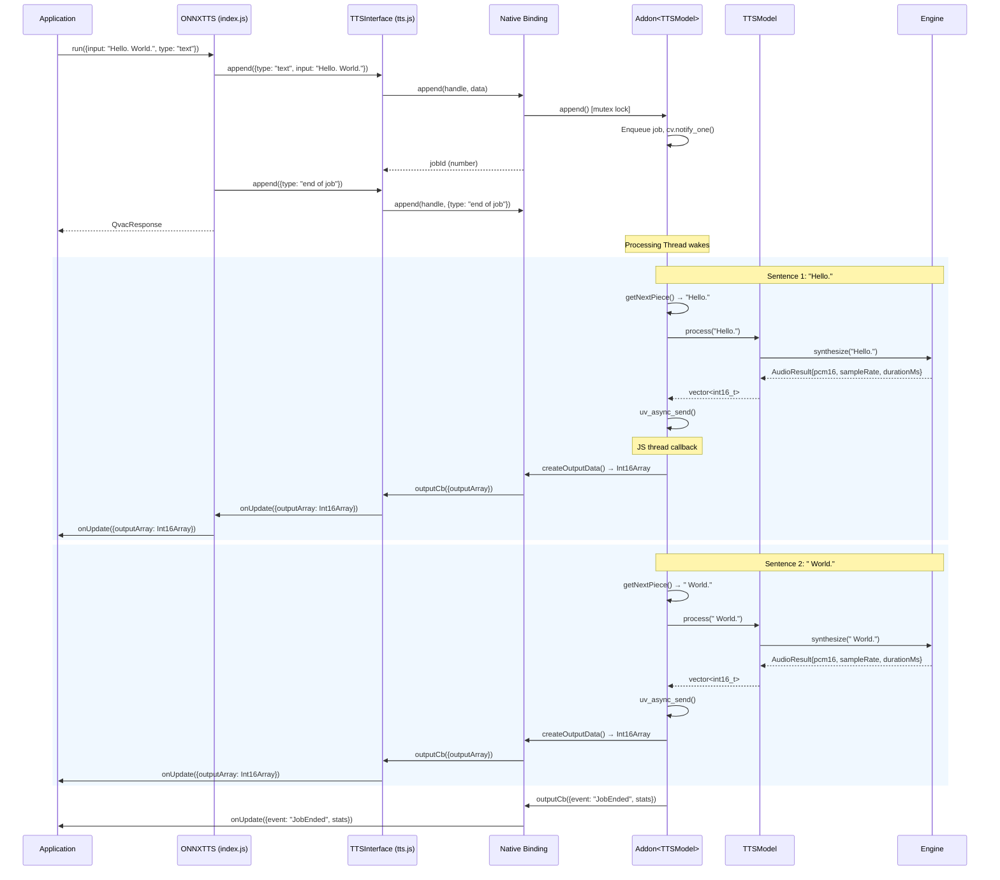
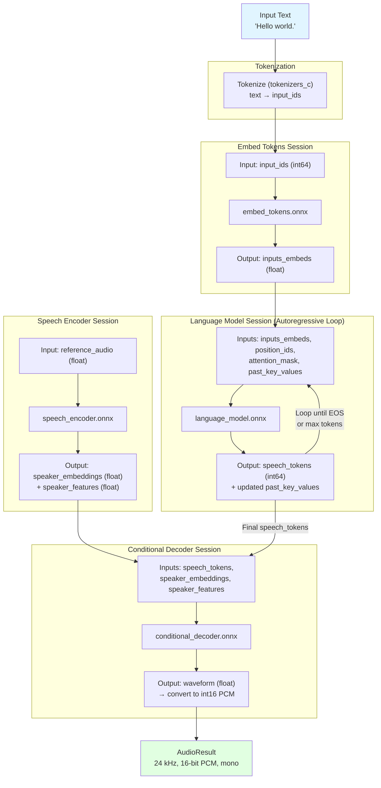
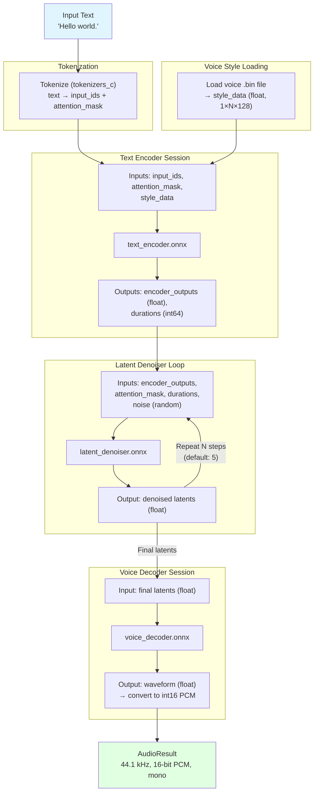
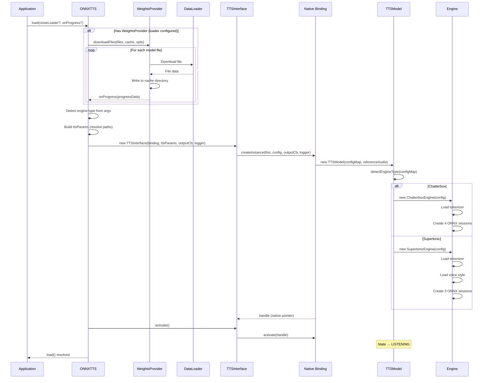
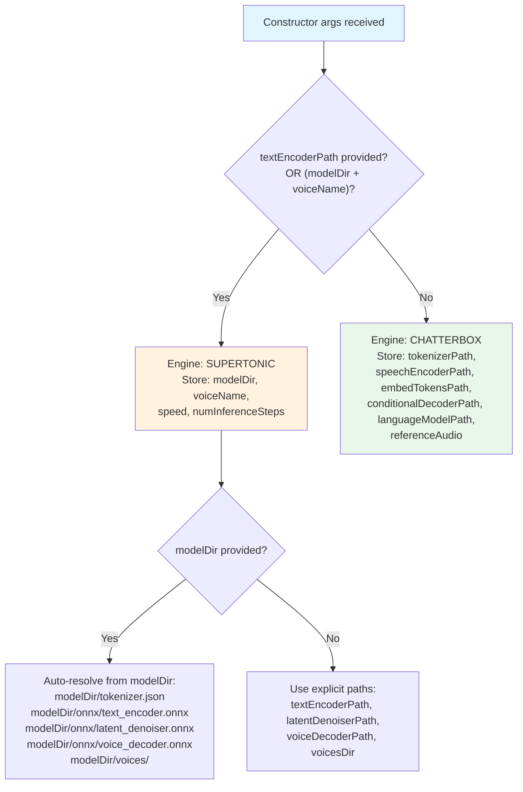

# Data Flows: @qvac/tts-onnx

> **⚠️ Warning:** These diagrams represent the data flows as of the last documentation update. Code changes may have introduced differences. For debugging, regenerate diagrams from current source code.

---

## Table of Contents

- [TTS Synthesis Flow (Primary)](#tts-synthesis-flow-primary)
- [Chatterbox Inference Pipeline](#chatterbox-inference-pipeline)
- [Supertonic Inference Pipeline](#supertonic-inference-pipeline)
- [Model Loading Flow](#model-loading-flow)
- [Engine Detection Flow](#engine-detection-flow)

---

## TTS Synthesis Flow (Primary)

The end-to-end flow from JavaScript `run()` call through to audio output delivery.

📊 LLM-Friendly: Synthesis Data Transformations

**Data Transformations per Stage:**

| Stage | Input | Output | Transform |
|-------|-------|--------|-----------|
| JS API (run) | `{input: string, type: "text"}` | QvacResponse | Wraps in response object |
| JS Bridge (append) | `{type, input}` object | jobId (number) | Extracts and forwards to native |
| Addon (getNextPiece) | Full text string | Sentence substring | Split on `.!?` with min 25 chars |
| TTSModel (process) | std::string sentence | vector&lt;int16_t&gt; PCM | Dispatches to active engine |
| Engine (synthesize) | std::string sentence | AudioResult | Full inference pipeline |
| Output handler | vector&lt;int16_t&gt; | JS Int16Array | memcpy into ArrayBuffer |
| JS callback | {outputArray: Int16Array} | User processes audio | Application-specific |

---

## Chatterbox Inference Pipeline

Detailed ONNX session execution order within `ChatterboxEngine::synthesize()`.

📊 LLM-Friendly: Chatterbox Session Details

**ONNX Sessions:**

| Session | Model File | Key Inputs | Key Outputs | Purpose |
|---------|-----------|------------|-------------|---------|
| Embed Tokens | embed_tokens.onnx | input_ids (int64) | inputs_embeds (float) | Convert token IDs to embeddings |
| Speech Encoder | speech_encoder.onnx | reference_audio (float) | speaker_embeddings, speaker_features | Extract speaker characteristics from reference audio |
| Language Model | language_model.onnx | inputs_embeds, position_ids, attention_mask, past_key_values | speech_tokens, updated past_key_values | Autoregressive speech token generation |
| Conditional Decoder | conditional_decoder.onnx | speech_tokens, speaker_embeddings, speaker_features | waveform (float) | Convert speech tokens to audio waveform |

**Pipeline Characteristics:**

| Property | Value |
|----------|-------|
| Autoregressive | Yes (language model loop) |
| Output sample rate | 24 kHz |
| Output format | 16-bit PCM, mono |
| Voice cloning | Yes (via reference audio → speech encoder) |
| Supported languages | en, es, fr, de, it, pt, ru |

---

## Supertonic Inference Pipeline

Detailed ONNX session execution order within `SupertonicEngine::synthesize()`.

📊 LLM-Friendly: Supertonic Session Details

**ONNX Sessions:**

| Session | Model File | Key Inputs | Key Outputs | Purpose |
|---------|-----------|------------|-------------|---------|
| Text Encoder | text_encoder.onnx | input_ids, attention_mask, style_data | encoder_outputs, durations | Encode text with voice style into latent space |
| Latent Denoiser | latent_denoiser.onnx | encoder_outputs, attention_mask, durations, noise | denoised latents | Iterative diffusion denoising (N steps) |
| Voice Decoder | voice_decoder.onnx | latents | waveform (float) | Decode latents into audio waveform |

**Pipeline Characteristics:**

| Property | Value |
|----------|-------|
| Autoregressive | No (diffusion-based) |
| Output sample rate | 44.1 kHz |
| Output format | 16-bit PCM, mono |
| Voice selection | Via voice .bin files (e.g., "F1.bin") |
| Denoising steps | Configurable (default: 5) |
| Speed control | Configurable multiplier (default: 1.0) |
| Supported languages | en, ko, es, pt, fr |

---

## Model Loading Flow

The complete flow from `ONNXTTS.load()` through weight downloading and native addon initialization.

📊 LLM-Friendly: Loading Sequence

**Model Files per Engine:**

| Engine | Files | Typical Combined Size |
|--------|-------|-----------------------|
| Chatterbox | tokenizer.json, speech_encoder.onnx, embed_tokens.onnx, conditional_decoder.onnx, language_model.onnx | ~500 MB–1 GB |
| Supertonic | tokenizer.json, text_encoder.onnx, latent_denoiser.onnx, voice_decoder.onnx, {voiceName}.bin | ~200–500 MB |

**State Transitions During Load:**

| Step | State | Trigger |
|------|-------|---------|
| 1 | UNLOADED | Initial state |
| 2 | LOADING | createInstance() called |
| 3 | LOADED | Model sessions created |
| 4 | LISTENING | activate() called, ready for input |

---

## Engine Detection Flow

How `ONNXTTS` determines which engine to use based on constructor arguments.

📊 LLM-Friendly: Engine Selection Rules

**Detection Logic (JavaScript — index.js):**

| Condition | Engine Selected |
|-----------|----------------|
| `textEncoderPath` is non-empty | Supertonic |
| `modelDir` AND `voiceName` are non-empty | Supertonic |
| Otherwise | Chatterbox |

**C++ Detection Logic (TTSModel.cpp):**

| Condition | Engine Selected |
|-----------|----------------|
| `configMap["textEncoderPath"]` is non-empty | Supertonic |
| `configMap["modelDir"]` AND `configMap["voiceName"]` are non-empty | Supertonic |
| Otherwise | Chatterbox |

---

**Last Updated:** 2026-02-18
