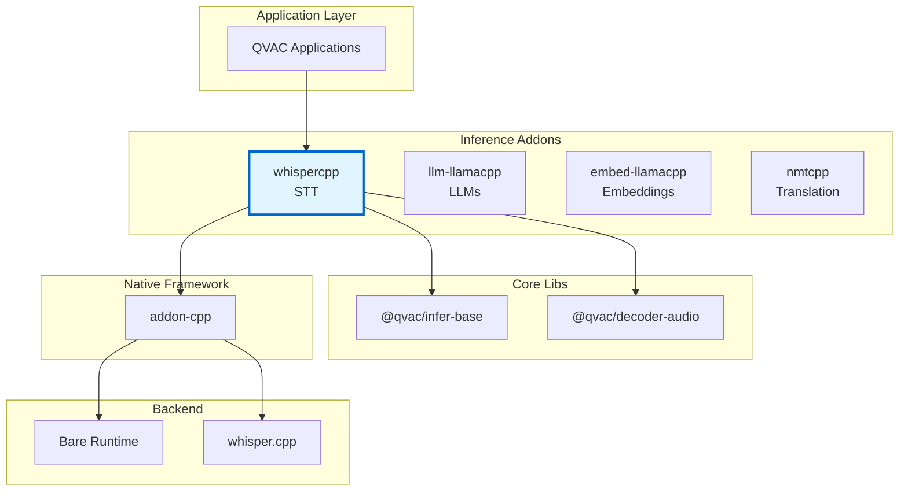
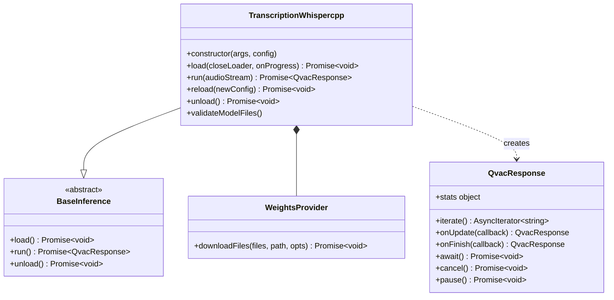
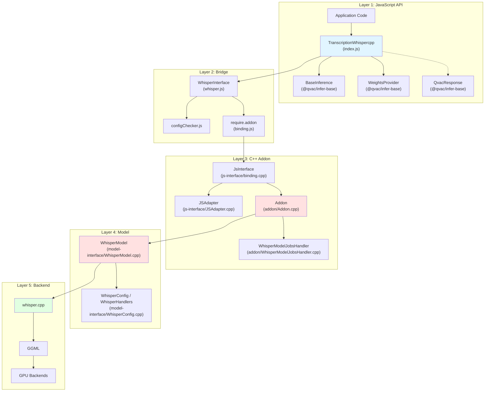
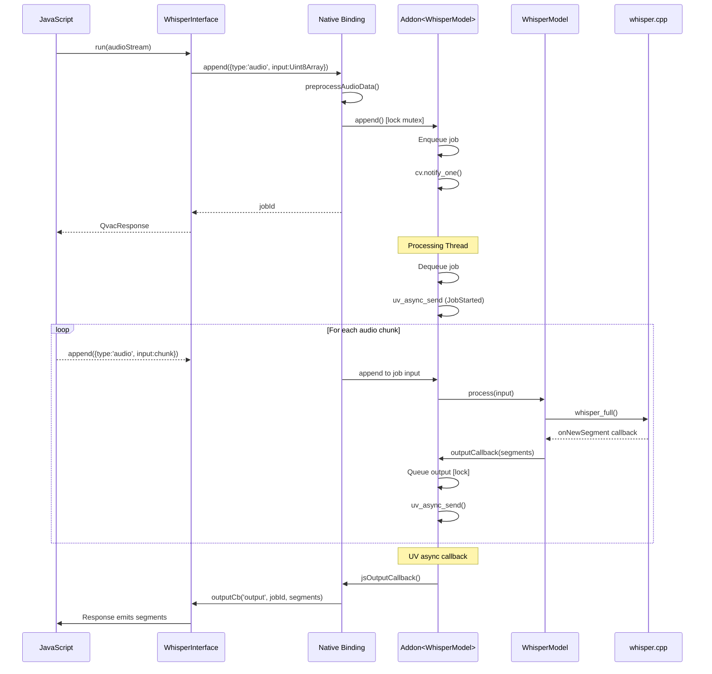

# Architecture Documentation

**Package:** `@qvac/transcription-whispercpp` v0.4.0  
**Stack:** JavaScript, C++20, whisper.cpp, Bare Runtime, CMake, vcpkg  
**License:** Apache-2.0

---

## Table of Contents

### Overview
- [Purpose](#purpose)
- [Key Features](#key-features)
- [Target Platforms](#target-platforms)

### Core Architecture
- [Package Context](#package-context)
- [Public API](#public-api)
- [Internal Architecture](#internal-architecture)
- [Core Components](#core-components)
- [Bare Runtime Integration](#bare-runtime-integration)

### Architecture Decisions
- [Decision 1: whisper.cpp as Inference Backend](#decision-1-whispercpp-as-inference-backend)
- [Decision 2: Bare Runtime over Node.js](#decision-2-bare-runtime-over-nodejs)
- [Decision 3: Shared Addon Framework](#decision-3-shared-addon-framework-qvac-lib-inference-addon-cpp)
- [Decision 4: Variant-Based Configuration Pipeline](#decision-4-variant-based-configuration-pipeline)
- [Decision 5: Silero VAD via whisper.cpp Built-in Support](#decision-5-silero-vad-via-whispercpp-built-in-support)

### Technical Debt
- [Addon Framework v1.0 → v1.1 Migration](#1-addon-framework-v10--v11-migration)
- [Singleton WhisperModelJobsHandler](#2-singleton-whispermodeljobshandler)
- [Audio Format Map Keyed by Instance Pointer](#3-audio-format-map-keyed-by-instance-pointer)

---

# Overview

## Purpose

`@qvac/transcription-whispercpp` is a cross-platform npm package providing speech-to-text transcription for Bare runtime applications. It wraps [whisper.cpp](https://github.com/ggerganov/whisper.cpp) in a JavaScript-friendly API, enabling local audio transcription on desktop and mobile with CPU/GPU acceleration.

**Core value:**
- High-level JavaScript API for speech-to-text inference
- Streaming transcription with real-time segment delivery
- Silero VAD integration for production-quality accuracy
- Unified interface shared with other QVAC inference backends
- Hot-reload of configuration without destroying the instance

## Key Features

- **Cross-platform**: macOS, Linux, Windows, iOS, Android
- **Streaming transcription**: Audio chunks appended in real-time; segments emitted as decoded
- **GPU acceleration**: Metal (Apple), Vulkan (Linux/Android/Windows) with automatic CPU fallback
- **Silero VAD**: Built-in Voice Activity Detection; significantly improves quality (effectively required for production)
- **Hot-reload**: Change language, VAD params, etc. at runtime; only context-level changes trigger full model reload
- **Runtime statistics**: Wall time, real-time factor, tokens/second, whisper.cpp internal timings

## Target Platforms

| Platform | Architecture | Min Version | Status | GPU Support |
|----------|-------------|-------------|--------|-------------|
| macOS | arm64, x64 | 14.0+ | ✅ Tier 1 | Metal |
| iOS | arm64 | 17.0+ | ✅ Tier 1 | Metal |
| Linux | arm64, x64 | Ubuntu-22+ | ✅ Tier 1 | Vulkan (CPU fallback) |
| Android | arm64 | 12+ | ✅ Tier 1 | Vulkan (CPU fallback) |
| Windows | x64 | 10+ | ✅ Tier 1 | Vulkan (CPU fallback) |

**Dependencies:**
- whisper.cpp (=1.7.5.1): Inference engine (GGML-based)
- qvac-lib-inference-addon-cpp: C++ addon framework (templated `Addon<Model>`)
- @qvac/infer-base (^0.2.0): Base classes, WeightsProvider, QvacResponse
- @qvac/decoder-audio (^0.3.3): Audio decoding and sample rate conversion
- @qvac/error (^0.1.0): Shared error code infrastructure
- @qvac/logging (^0.1.0): Structured logging
- Bare Runtime (≥1.19.0): JavaScript runtime

---

# Core Architecture

## Package Context

### Ecosystem Position

📊 LLM-Friendly: Package Relationships

**Dependency Table:**

| Package | Type | Version | Purpose |
|---------|------|---------|---------|
| @qvac/infer-base | Framework | ^0.2.0 | Base classes, WeightsProvider, QvacResponse |
| @qvac/decoder-audio | Runtime | ^0.3.3 | Audio decoding and resampling |
| @qvac/dl-hyperdrive | Peer | ^0.1.0 | P2P model loading |
| qvac-lib-inference-addon-cpp | Native | — | C++ addon framework |
| whisper.cpp | Native | =1.7.5.1 | Inference engine |
| Bare Runtime | Runtime | ≥1.19.0 | JavaScript execution |

**Integration Points:**

| From | To | Mechanism | Data Format |
|------|-----|-----------|-------------|
| JavaScript | TranscriptionWhispercpp | Constructor | args, config objects |
| TranscriptionWhispercpp | BaseInference | Inheritance | Template method pattern |
| TranscriptionWhispercpp | WhisperInterface | Composition | Method calls |
| WhisperInterface | C++ Addon | require.addon() | Native binding |
| WeightsProvider | Data Loader | Interface | Stream protocol |

---

## Public API

### Main Class: TranscriptionWhispercpp

📊 LLM-Friendly: Class Responsibilities

**Component Roles:**

| Class | Responsibility | Lifecycle | Dependencies |
|-------|----------------|-----------|--------------|
| TranscriptionWhispercpp | Orchestrate model lifecycle, manage audio streaming | Created by user, persistent | WeightsProvider, WhisperInterface |
| BaseInference | Define standard inference API | Abstract base class | None |
| QvacResponse | Stream inference output | Created per run() call, short-lived | None |
| WeightsProvider | Abstract model weight loading | Created by TranscriptionWhispercpp | DataLoader |

**Key Relationships:**

| From | To | Type | Purpose |
|------|-----|------|---------|
| TranscriptionWhispercpp | BaseInference | Inheritance | Standard QVAC inference API |
| TranscriptionWhispercpp | WeightsProvider | Composition | Model weight acquisition |
| TranscriptionWhispercpp | QvacResponse | Creates | Streaming output per inference |

---

## Internal Architecture

### Architectural Pattern

The package follows a **layered architecture** with clear separation of concerns:

📊 LLM-Friendly: Layer Responsibilities

**Layer Breakdown:**

| Layer | Components | Responsibility | Language | Why This Layer |
|-------|------------|----------------|----------|----------------|
| 1. JavaScript API | TranscriptionWhispercpp, BaseInference | High-level API, config normalization | JS | Ergonomic API for npm consumers |
| 2. Bridge | WhisperInterface, configChecker, binding.js | JS↔C++ communication, validation | JS wrapper | Lifecycle management, handle safety |
| 3. C++ Addon | JsInterface, JSAdapter, Addon\<T\>, JobsHandler | Job queue, threading, config conversion | C++ | Performance, native integration |
| 4. Model | WhisperModel, WhisperConfig | Inference logic, parameter mapping | C++ | Direct whisper.cpp integration |
| 5. Backend | whisper.cpp, GGML | Audio processing, GPU kernels | C++ | Optimized inference |

**Data Flow Through Layers:**

| Direction | Path | Data Format | Transform |
|-----------|------|-------------|-----------|
| Input → | JS → Bridge → Addon | Uint8Array (PCM) | Pass audio bytes |
| Input → | Addon → Model | std::vector\<float\> | preprocessAudioData (s16le/f32le → float) |
| Input → | Model → whisper.cpp | float* + count | whisper_full() |
| Output ← | whisper.cpp → Model | segments | onNewSegment callback |
| Output ← | Model → Addon | Transcript struct | Queue output |
| Output ← | Addon → Bridge | JS array of objects | uv_async_send → jsOutputCallback |
| Output ← | Bridge → JS | {text, start, end, id} | Emit via response callback |

---

## Core Components

### JavaScript Components

#### **TranscriptionWhispercpp (index.js)**

**Responsibility:** Main API class, orchestrates model lifecycle, manages audio stream consumption

**Why JavaScript:**
- High-level API ergonomics for npm consumers
- Promise/async-await integration for streaming
- Configuration normalization and default-filling
- Weight download orchestration via WeightsProvider

#### **WhisperInterface (whisper.js)**

**Responsibility:** JavaScript wrapper around native addon, manages handle lifecycle

**Why JavaScript:**
- Clean JavaScript API over raw C++ bindings
- Native handle lifecycle management (createInstance → destroyInstance)
- Error wrapping with `QvacErrorAddonWhisper` (codes 6001–6009)

#### **configChecker (configChecker.js)**

**Responsibility:** Whitelist-based parameter validation before crossing JS/C++ boundary

- Validates `whisperConfig`, `contextParams`, `miscConfig` sections exist
- Rejects unknown parameter keys against explicit whitelists
- Catches invalid configuration before any C++ allocation

### C++ Components

#### **WhisperModel (model-interface/WhisperModel.cpp)**

**Responsibility:** Core inference implementation wrapping whisper.cpp

**Why C++:**
- Direct integration with whisper.cpp C API
- Audio preprocessing (PCM conversion) at native speed
- Segment callback integration with whisper_full()
- Runtime statistics collection (timings, tokens, segments)

#### **Addon\<WhisperModel\> (addon/Addon.cpp)**

**Responsibility:** Template specialization of addon framework

**Why C++:**
- Provides job queue and priority scheduling
- Dedicated processing thread
- Thread-safe state machine (Unloaded → Loading → Idle → Listening → Processing → Paused → Stopped)
- Output dispatching via uv_async

**Specialization:** Constructor takes `WhisperConfig`, `jsOutputCallback` marshals `Transcript` structs to JS arrays of `{text, toAppend, start, end, id}`

#### **WhisperModelJobsHandler (addon/WhisperModelJobsHandler.cpp)**

**Responsibility:** Singleton job processing loop

- Manages job lifecycle: dequeue → start → process → end
- Coordinates model loading (lazy, on first job)
- Model warmup with silent audio on first load
- Error handling with `OutputEvent::Error` propagation

#### **JSAdapter (js-interface/JSAdapter.cpp)**

**Responsibility:** Converts JavaScript objects to C++ `WhisperConfig` struct

- Traverses JS object properties via `js.h` API
- Populates four variant maps: `whisperMainCfg`, `vadCfg`, `whisperContextCfg`, `miscConfig`
- Type conversion: JS boolean/number/string → `std::variant<monostate, int, double, string, bool>`

#### **WhisperConfig / WhisperHandlers (model-interface/WhisperConfig.cpp)**

**Responsibility:** Maps variant-based config to whisper.cpp parameter structs

- `toWhisperFullParams()`: variant maps → `whisper_full_params` with VAD
- `toWhisperContextParams()`: variant maps → `whisper_context_params` (model path, GPU settings)
- `toMiscConfig()`: variant maps → `MiscConfig` (caption mode, seed)
- Declarative handler maps enable adding new parameters without structural changes

---

## Bare Runtime Integration

### Communication Pattern

📊 LLM-Friendly: Thread Communication

**Thread Responsibilities:**

| Thread | Runs | Blocks On | Can Call |
|--------|------|-----------|----------|
| JavaScript | App code, callbacks | Nothing (event loop) | All JS, addon methods |
| Processing | Inference | model.process() | model.*, uv_async_send() |

**Synchronization Primitives:**

| Primitive | Purpose | Held Duration | Risk |
|-----------|---------|---------------|------|
| std::mutex | Protect job queue + output queue | <1ms | Low (brief) |
| std::condition_variable | Wake processing thread | N/A | None |
| uv_async_t | Wake JS thread | N/A | None |

**Thread Safety Rules:**

1. ✅ Call addon methods from any thread
2. ✅ Processing thread calls model methods
3. ❌ Don't call JS functions from C++ thread (use uv_async_send)
4. ❌ Don't call model methods from JS thread

---

# Architecture Decisions

## Decision 1: whisper.cpp as Inference Backend

⚡ TL;DR

**Chose:** whisper.cpp (GGML) for on-device speech-to-text  
**Why:** Optimized C++ Whisper implementation, broad hardware support, built-in VAD  
**Cost:** Pinned to specific version, tied to whisper.cpp release cadence

### Context

Need a performant, cross-platform speech-to-text engine that runs on-device without cloud dependencies, supporting:
- Multiple languages and Whisper model sizes
- GPU acceleration on diverse hardware
- Voice Activity Detection for production quality

### Decision

Use whisper.cpp (via vcpkg, pinned to v1.7.5.1) as the sole inference backend.

### Rationale

**Performance:**
- Highly optimized C/C++ implementation of OpenAI's Whisper model
- GGML format enables quantized models for reduced memory and faster inference on edge devices
- GPU acceleration via Metal (Apple) and Vulkan (cross-platform)

**Features:**
- Built-in Silero VAD integration (v1.7.x+) eliminates need for separate VAD pipeline
- Supports all Whisper model sizes (tiny through large-v3)
- Active open-source community with frequent releases

### Trade-offs
- ✅ Runs fully on-device — no network dependency at inference time
- ✅ Quantized models enable deployment on resource-constrained devices
- ❌ Tied to whisper.cpp release cadence for model and feature updates
- ❌ Pinned to v1.7.5.1 via vcpkg override — upgrading requires compatibility verification

---

## Decision 2: Bare Runtime over Node.js

See [qvac-lib-inference-addon-cpp Decision 4: Why Bare Runtime](https://github.com/tetherto/qvac/blob/main/packages/qvac-lib-inference-addon-cpp/docs/architecture.md#decision-4-why-bare-runtime) for rationale.

**Summary:** Mobile support (iOS/Android), lightweight, modern addon API via `js.h`. Core business logic remains runtime-agnostic.

---

## Decision 3: Shared Addon Framework (`qvac-lib-inference-addon-cpp`)

⚡ TL;DR

**Chose:** Shared, templated C++ addon framework (`Addon<Model>`)  
**Why:** Eliminate duplication of threading, job queues, state machines across inference packages  
**Cost:** Template specialization complexity, coordinated framework upgrades

### Context

Multiple inference packages (whisper, llama.cpp, NMT, embeddings) need the same C++ addon patterns: threading, job queues, state machines, output callbacks.

### Decision

Use a shared, templated C++ addon framework (`Addon<Model>`) parameterized by the model type. Each package implements only model-specific logic.

### Rationale

**Code Reuse:**
- Eliminates duplication of threading, state management, and JS-bridge code
- Each package only implements `WhisperModel`, `WhisperModelJobsHandler`, etc.
- Bug fixes in the framework benefit all packages simultaneously

**Consistency:**
- Identical addon lifecycle (Unloaded → Loading → Idle → Listening → Processing → Paused → Stopped) across all backends
- Same output event protocol (JobStarted, Output, JobEnded, Error)
- Same `uv_async_t` communication pattern to JS

### Trade-offs
- ✅ Consistent behavior and lifecycle across all inference backends
- ✅ Framework improvements benefit all packages
- ❌ Template specializations (in `Addon.cpp`) can be complex to debug
- ❌ Framework upgrades (e.g., to v1.1) require coordinated refactoring across packages

---

## Decision 4: Variant-Based Configuration Pipeline

⚡ TL;DR

**Chose:** Multi-stage pipeline: JS Object → JSAdapter → WhisperConfig (variant maps) → WhisperHandlers → whisper.cpp structs  
**Why:** Decouple JS types from whisper.cpp types, declarative parameter mapping  
**Cost:** Indirection through variant maps, parameter names must stay in sync

### Context

whisper.cpp has numerous parameters across multiple C structs (`whisper_full_params`, `whisper_context_params`, `whisper_vad_params`). These must be configurable from JavaScript while keeping the C++ layer decoupled from JS types.

### Decision

Use a multi-stage configuration pipeline with variant-based intermediate representation and declarative handler maps.

### Rationale

**Extensibility:**
- Adding new whisper.cpp parameters requires only a new handler entry — no structural changes
- Four separate variant maps (`whisperMainCfg`, `vadCfg`, `whisperContextCfg`, `miscConfig`) mirror whisper.cpp's struct groupings
- `configChecker.js` provides early JS-side whitelist validation before crossing the bridge

**Decoupling:**
- `WhisperConfig` uses `std::map<string, variant>` — no dependency on `js.h` types
- `JSAdapter` handles all JS↔C++ type conversion in one place
- `WhisperHandlers` declaratively map variant keys to struct fields with validation

### Trade-offs
- ✅ New parameters exposed by adding a single handler entry + whitelist entry
- ✅ JS-side validation catches invalid parameters before any C++ allocation
- ❌ Indirection through variant maps adds complexity vs. direct struct population
- ❌ Parameter names must be kept in sync across `configChecker.js`, `JSAdapter`, and `WhisperHandlers`

---

## Decision 5: Silero VAD via whisper.cpp Built-in Support

⚡ TL;DR

**Chose:** whisper.cpp's built-in Silero VAD rather than a separate external VAD pipeline  
**Why:** Single inference call, no IPC overhead, native integration  
**Cost:** Silero-only (not pluggable), requires separate VAD model file

### Context

Raw audio often contains silence, noise, or non-speech segments that degrade transcription quality and waste compute. Voice Activity Detection is needed to filter non-speech.

### Decision

Use whisper.cpp's built-in Silero VAD integration rather than a separate external VAD pipeline.

### Rationale

**Simplicity:**
- whisper.cpp v1.7.x integrates Silero VAD natively — no separate pre-processing pipeline needed
- VAD parameters are passed alongside transcription parameters in `whisper_full_params`
- Single model load path for both VAD and transcription

**Quality:**
- Significantly improves transcription accuracy
- Effectively required for production use

### Trade-offs
- ✅ Single inference call handles both VAD and transcription
- ✅ No inter-process communication overhead between VAD and STT
- ❌ Silero is the only supported VAD; not pluggable for alternative VAD models
- ❌ Requires a separate Silero VAD model file alongside the Whisper model

---

# Technical Debt

### 1. Addon Framework v1.0 → v1.1 Migration
**Status:** Planned  
**Issue:** Current dependency on `qvac-lib-inference-addon-cpp` v1.0; upcoming v1.1 will change internal APIs  
**Root Cause:** v1.1 framework is not yet finalized; migration requires coordinated changes across all inference packages  
**Plan:** Refactor once v1.1 is stable; update `Addon.hpp/cpp`, `WhisperModelJobsHandler`, and `binding.cpp` specializations

### 2. Singleton WhisperModelJobsHandler
**Status:** Active  
**Issue:** All `Addon<WhisperModel>` instances share a single `WhisperModelJobsHandler` (singleton via `std::once_flag`), preventing truly independent concurrent whisper instances  
**Root Cause:** Inherited from current addon framework design  
**Plan:** Address as part of the v1.1 migration

### 3. Audio Format Map Keyed by Instance Pointer
**Status:** Active  
**Issue:** Audio format per instance stored in a static `std::unordered_map<uintptr_t, std::string>` that is never cleaned up on `destroyInstance`, causing a minor memory leak  
**Root Cause:** Low severity; entries are small and instances are typically long-lived  
**Plan:** Clean up the map entry in `destroyInstance`, or move `audio_format` into `WhisperConfig`

---

**Related Document:**
- [data-flows-detailed.md](data-flows-detailed.md) - Detailed data flow diagrams and sequences

**Last Updated:** 2026-02-17
