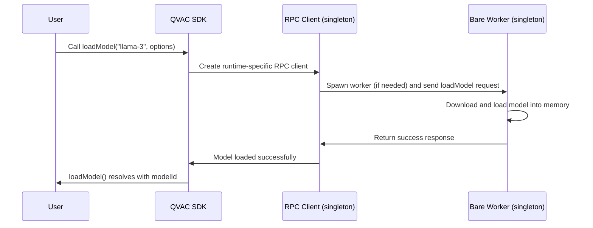

[](https://qvac.tether.dev)

---

**QVAC** is an open-source, cross-platform **ecosystem** for local-first, peer-to-peer **AI**. QVAC runs on [**Bare**](https://bare.pears.com) by [Holepunch](https://holepunch.to), a lightweight, cross-platform JavaScript runtime.

# QVAC SDK

**QVAC SDK** is the canonical entry point to develop AI applications with QVAC.

> _Part of **QVAC** ecosystem_
> <br>
> <sup>
> <a href="https://qvac.tether.dev" >Home</a> &nbsp;•&nbsp;
> <a href="https://qvac.tether.dev/docs" >Docs</a> &nbsp;•&nbsp;
> <a href="https://discord.com/channels/1425125849346216029/1445400675189264516" >Support</a> &nbsp;•&nbsp;
> <a href="https://discord.com/invite/tetherdev" >Discord</a>
> </sup>

Written in TypeScript, it provides all QVAC capabilities through a unified interface while also abstracting away the complexity of running your application in a JS environment other than Bare.

For the comprehensive reference, [see official QVAC documentation](https://qvac.tether.dev/docs).

## Requirements

Supported JS environments: Bare, Node.js, Expo and Bun.

## Installation

```bash
npm install @qvac/sdk
```

### Linux

OS peer dependency:

```bash
apt install vulkan-sdk
```

### Expo

1. Peer dependencies:

```bash
npm i expo-file-system react-native-bare-kit
```

2. On Android, bump `minSdkVersion` to 29, by adding `ext { minSdkVersion=29 }` to `android/build.gradle` or using `expo-build-properties`.

3. Add the QVAC Expo plugin to `app.json`:

```js
export default {
  expo: {
    plugins: ["@qvac/sdk/expo-plugin"],
  },
};
```

4. Prebuild your project to generate the native files:

```bash
npx expo prebuild
```

5. Build and run it on a **physical device**:

```bash
npx expo run:ios --device
# or
npx expo run:android --device
```

> [!IMPORTANT]  
> Due to limitations with `llamacpp`, QVAC currently does not run on emulators. You **must** use a physical device.

## Usage

```js
import {
  completion,
  LLAMA_3_2_1B_INST_Q4_0,
  loadModel,
  downloadAsset,
  unloadModel,
  VERBOSITY,
} from "@qvac/sdk";
try {
  // First just cache the model
  await downloadAsset({
    assetSrc: LLAMA_3_2_1B_INST_Q4_0,
    onProgress: (progress) => {
      console.log(progress);
    },
  });
  // Then load it in memory from cache
  const modelId = await loadModel({
    modelSrc: LLAMA_3_2_1B_INST_Q4_0,
    modelType: "llm",
    modelConfig: {
      device: "gpu",
      ctx_size: 2048,
      verbosity: VERBOSITY.ERROR,
    },
  });
  const history = [
    {
      role: "user",
      content: "Explain quantum computing in one sentence, use lots of emojis",
    },
  ];
  const result = completion({ modelId, history, stream: true });
  for await (const token of result.tokenStream) {
    process.stdout.write(token);
  }
  const stats = await result.stats;
  console.log("\n📊 Performance Stats:", stats);
  // Change `clearStorage: true` to delete cached model files
  await unloadModel({ modelId, clearStorage: false });
} catch (error) {
  console.error("❌ Error:", error);
  process.exit(1);
}
```

## Functionalities

### AI tasks

- Completion: LLM inference via [`llama.cpp`](https://github.com/ggml-org/llama.cpp).
- Transcription: speech-to-text (ASR) via [`whisper.cpp`](https://github.com/ggml-org/whisper.cpp).
- Text embeddings: via `llama.cpp`, for RAG.
- Translation: between different languages.
- Text-to-Speech: TTS via ONNX.
- Multimodal: via [`llama.cpp`] — i.e., process and understand multiple types of media within the same conversation context.
- RAG: retrieval-augmented generation with progress streaming, cancellation, and workspace management.
- Delegated inference: perform peer-to-peer edge inference via Holepunch stack.

### Utilities

- Configuration: customize SDK behavior via config files (`qvac.config.json`, `.js`, or `.ts`).
- Logging: visibility into what's happening inside your models during loading, inference, and other operations.
- Download Lifecycle: pause and resume model downloads.
- Blind Relays: establish peer connections through NAT/firewalls by routing traffic through relay nodes.
- Sharded models: download a model that is sharded into multiple parts.

## Examples

In the `./examples` subdirectory, you will find scripts demonstrating how to use all SDK functionalities. To try any of them:

1. Build the SDK from source (see [Build](#build) section).
2. Run using Bare, Node.js, or Bun as the runtime:

```bash
# With Bare
bun run bare:example dist/examples/path/to/example.js

# With Node
node dist/examples/path/to/example.js

# With bun, straight from source
bun run examples/path/to/example.ts
```

### Completion

- `llama.cpp` with local files: [`examples/llamacpp-filesystem.ts`](examples/llamacpp-filesystem.ts)
- `llama.cpp` with P2P registry: [`examples/llamacpp-p2p.ts`](examples/llamacpp-p2p.ts)
- `llama.cpp` with HTTP: [`examples/llamacpp-http.ts`](examples/llamacpp-http.ts)
- `llama.cpp` with tools/function calls: [`examples/llamacpp-native-tools.ts`](examples/llamacpp-native-tools.ts)
- `llama.cpp` with multimodal inference: [`examples/llamacpp-multimodal.ts`](examples/llamacpp-multimodal.ts)
- `llama.cpp` with KV cache: [`examples/kv-cache-example.ts`](examples/kv-cache-example.ts)

### Transcription

- `whisper.cpp` transcription: [`examples/whispercpp-filesystem.ts`](examples/whispercpp-filesystem.ts)
- Microphone recording: [`examples/whispercpp-microphone-record.ts`](examples/whispercpp-microphone-record.ts)

### Embeddings

- Single and batch embeddings: [`examples/embed-p2p.ts`](examples/embed-p2p.ts)

**RAG with HyperDB** (cross-platform):

- Ingest (full pipeline): [`examples/rag/rag-hyperdb/ingest.ts`](examples/rag/rag-hyperdb/ingest.ts)
- Segregated pipeline: [`examples/rag/rag-hyperdb/pipeline.ts`](examples/rag/rag-hyperdb/pipeline.ts) _(Segregated flow: chunk → embed → save)_
- Workspaces: [`examples/rag/rag-hyperdb/workspaces.ts`](examples/rag/rag-hyperdb/workspaces.ts) _(Workspace lifecycle: list, close, delete)_
- Cancellation: [`examples/rag/rag-hyperdb/cancellation.ts`](examples/rag/rag-hyperdb/cancellation.ts) _(progress + cancel)_

**RAG with other backends** (desktop only):

- LanceDB: [`examples/rag/rag-lancedb.ts`](examples/rag/rag-lancedb.ts)
- ChromaDB: [`examples/rag/rag-chromadb.ts`](examples/rag/rag-chromadb.ts) _(requires ChromaDB server)_
- SQLite-Vector: [`examples/rag/rag-sqlite.ts`](examples/rag/rag-sqlite.ts) _(SQLite-Vector WASM)_

### Translation

- Marian OPUS translation: [`examples/translation/translation-opus.ts`](examples/translation/translation-opus.ts)
- Indic language translation: [`examples/translation/translation-indic.ts`](examples/translation/translation-indic.ts)
- LLM-based translation: [`examples/translation/translation-llm.ts`](examples/translation/translation-llm.ts)

### Text-to-Speech

- TTS (Chatterbox): [`examples/tts/chatterbox.ts`](examples/tts/chatterbox.ts) _(voice cloning with reference audio)_
- TTS (Supertonic): [`examples/tts/supertonic.ts`](examples/tts/supertonic.ts) _(general-purpose, no voice cloning)_

### Multimodel

- Load multiple models simultaneously: [`examples/multi-model-demo.ts`](examples/multi-model-demo.ts)

### Delegated inference

- Provider: [`examples/delegated-inference/provider.ts`](examples/delegated-inference/provider.ts)
- Consumer: [`examples/delegated-inference/consumer.ts`](examples/delegated-inference/consumer.ts)

> [!TIP]
> Set `QVAC_HYPERSWARM_SEED` env var to ensure that the provider uses the same keypair (i.e., public key doesn't change on every run).

> [!NOTE]
> Consumer does not handle reconnection yet.

### Logging

Stream real-time logs from the SDK server and native addons:

```ts
import { loggingStream, SDK_LOG_ID } from "@qvac/sdk";

// SDK server logs (general operations)
for await (const log of loggingStream({ id: SDK_LOG_ID })) {
  console.log(`[${log.level}] ${log.namespace}: ${log.message}`);
}

// Addon logs per model (llamacpp, whispercpp, etc.)
for await (const log of loggingStream({ id: modelId })) {
  console.log(`[${log.level}] ${log.namespace}: ${log.message}`);
}
```

- Log streaming: [`examples/logging-streaming.ts`](examples/logging-streaming.ts)
- Log with custom file transport: [`examples/logging-file-transport.ts`](examples/logging-file-transport.ts)

### Configuration

Customize SDK behavior using a config file. The SDK auto-discovers `qvac.config.{json,js,ts}` in your project root, or you can specify a path via `QVAC_CONFIG_PATH` environment variable.

**Supported formats:**

- `qvac.config.json` - JSON format
- `qvac.config.js` - JavaScript with `export default`
- `qvac.config.ts` - TypeScript with `export default`

**Available options:**

| Option                    | Type       | Default          | Description                                         |
| ------------------------- | ---------- | ---------------- | --------------------------------------------------- |
| `cacheDirectory`          | `string`   | `~/.qvac/models` | Where models and assets are stored                  |
| `swarmRelays`             | `string[]` | `[]`             | Hyperswarm relay public keys for P2P                |
| `loggerLevel`             | `string`   | `"info"`         | Log level: `"error"`, `"warn"`, `"info"`, `"debug"` |
| `loggerConsoleOutput`     | `boolean`  | `true`           | Enable/disable console output                       |
| `httpDownloadConcurrency` | `number`   | `3`              | Max concurrent HTTP downloads for sharded models    |
| `httpConnectionTimeoutMs` | `number`   | `10000`          | HTTP connection timeout in milliseconds             |

- Config usage example: [`examples/default-config-usage.ts`](examples/default-config-usage.ts)

### Download Lifecycle

- Pause and resume download: [`examples/download-with-cancel.ts`](examples/download-with-cancel.ts)

### Blind Relays

Blind relays help establish peer connections through NAT/firewalls by routing traffic through relay nodes.

- Model downloads via Hyperdrive: [`examples/download-with-blind-relays.ts`](./examples/download-with-blind-relays.ts)
- Delegated inference: You can reuse the same pattern for delegated inference by adding `swarmRelays` to your config file before starting your provider/consumer.

> [!NOTE]
> The examples use mock relay keys. For real deployments, you **must** use your own relay servers or trusted public relays.

### Sharded Models

Sharded models are split into multiple files following the pattern: `<name>-00001-of-0000X.<ext>`. The SDK automatically downloads and loads all parts with detailed progress tracking.

**Supported formats:**

- Archives (`.tar`, `.tar.gz`, `.tgz`): HTTP or local with automatic extraction
- HTTP sharded URL: pass the download URL of any shard and the SDK will fetch the remaining shards
- Hyperdrive: use any sharded Hyperdrive model source
- Local shards: pass the path to any shard file. _(Note: All shards must be in the same directory)_

See: [`examples/llamacpp-sharded.ts`](examples/llamacpp-sharded.ts)

## Basic flow



**Note**: The example uses mock relay keys. In real deployments, you **must** use your own relay servers or trusted public relays.

### Hot Config Reload

Hot config reload allows you to update model configurations on-the-fly without unloading the model. Pass `modelId` (instead of `modelSrc`) to `loadModel` with the `modelType` and new `modelConfig` to apply changes instantly.

- Config reload using whisper: [`examples/config-reload.ts`](examples/config-reload.ts)

**Note**: Config reload is currently supported for Whisper models. All config parameters except `contextParams` (GPU settings, flash attention) can be hot reloaded. `contextParams` are load-time only and require full model reload. More model types coming soon.

## Contributing

### Commit Message and PR Title Format

This repository enforces structured commit messages and PR titles to maintain consistency and generate changelogs automatically.

#### Format

**Commit messages:**

```
prefix[tags]?: subject
```

**PR titles:**

```
TICKET prefix[tags]: subject
```

#### Allowed Prefixes

- `feat` - New features or capabilities
- `fix` - Bug fixes
- `doc` - Documentation changes
- `test` - Test additions or modifications
- `mod` - Model-related changes
- `chore` - Maintenance tasks
- `infra` - CI/CD, tooling, infrastructure

#### Allowed Tags

Tags are optional:

- `[api]` - API changes (non-breaking)
- `[bc]` - Breaking changes (including breaking API changes)

#### Examples

**Valid commit messages:**

```bash
feat: add RAG support for LanceDB
fix[api]: fix completion stream error handling
doc: update installation instructions
feat[bc]: redesign loadModel signature
chore: update dependencies
```

**Valid PR titles:**

```bash
QVAC-123 feat: add RAG support for LanceDB
QVAC-456 fix[api]: fix completion stream error handling
QVAC-789 doc: update installation instructions
QVAC-101 feat[bc]: redesign loadModel signature
```

#### Code Examples Requirements

When creating PRs with specific tags, you must include code examples in the PR description:

**`[bc]` tag requirements:**

Must include BEFORE/AFTER code examples showing the migration path:

````markdown
## BC Changes

**BEFORE:**

```typescript
const model = await loadModel("model-path");
```

**AFTER:**

```typescript
const modelId = await loadModel("model-path", { modelType: "llm" });
```
````

Or using inline comments:

````markdown
```typescript
// old
const model = await loadModel("model-path");

// new
const modelId = await loadModel("model-path", { modelType: "llm" });
```
````

**`[api]` tag requirements (non-breaking):**

Must include at least one fenced code block showing the new API usage:

````markdown
## New API

```typescript
// New completion API with streaming support
for await (const token of completion({
  modelId,
  history: [{ role: "user", content: "Hello!" }],
}).tokenStream) {
  process.stdout.write(token);
}
```
````

#### Validation

- **Commit messages** are validated automatically via Husky commit-msg hook
- **PR titles and descriptions** are validated via GitHub Actions on PR creation/update
- Invalid commits or PRs will be rejected with helpful error messages
- **Auto-skipped commits:** The following Git-generated commits bypass validation:
  - Merge commits (e.g., `Merge pull request #123`)
  - Version bumps (e.g., `1.0.0`, `v1.0.0`)
  - Revert commits (e.g., `Revert "feat: add feature"`)
  - Squash commits (e.g., `squash! fix: bug fix`)

#### Generating Changelogs

Once your PRs are merged into `dev`, you can generate a changelog:

```bash
npm run changelog:generate
```

This will:

1. Compare versions between `dev` and `main` branches
2. Collect all merged PRs
3. Parse and classify each PR by prefix
4. Generate `changelog/<version>/CHANGELOG.md`
5. Generate `changelog/<version>/breaking.md` for BC changes (with code examples)
6. Generate `changelog/<version>/api.md` for API changes (with code examples)

**Note:** Requires a GitHub token (`GITHUB_TOKEN` or `GH_TOKEN` environment variable) to fetch PR metadata.

## Build

Use the [Bun](https://bun.sh/) package manager:

```bash
bun i
```

```bash
bun run build  # or `watch` for hotreload
```

```bash
bun run build:pack
```

This outputs a tarball under `dist/sdk-{version}.tgz` that you can install in your project, e.g.:

```bash
npm i path/to/sdk-0.3.0.tgz
```

## More Resources

- [Comprehensive documentation of this SDK](https://qvac.tether.dev/docs/sdk)
- [Package at NPM](https://www.npmjs.com/package/@qvac/sdk)
